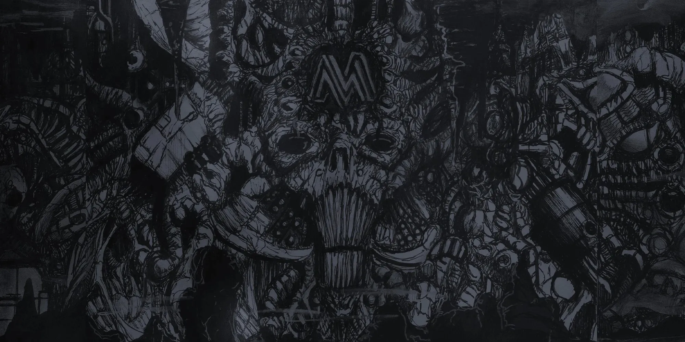
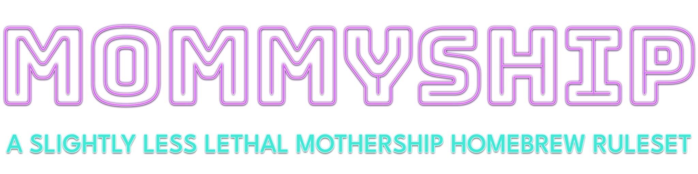
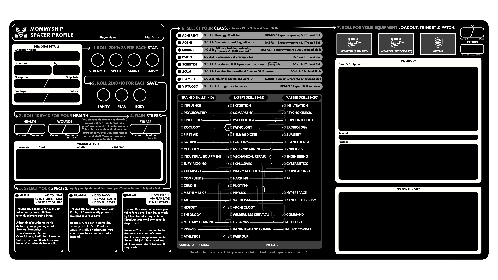

  

  

---

***A mildly friendlier, more robust, and ever-so-slightly less deadly homebrew ruleset for the Mothership Sci-Fi Horror RPG. Lots of things have been rebalanced and reconfigured, but for those familiar, it's easy to jump in!***

**Read the full rules at [mommyship.mom](https://mommyship.mom/)**! (That's dot-MOM not dot-COM. Important distinction.)

---

Hey there, spacer! ***Mommyship*** is a homebrew table ruleset built on top of the excellent [Mothership RPG](https://www.tuesdayknightgames.com/pages/mothership-rpg) by Tuesday Knight Games. It patches some gaps we kept hitting at our own table: MANY more character options, an actual social stat, broadened gear variety, deeper and more customizable ship rules, a modular mech-droid companion system, a brand-new character sheet, and a whole original galaxy to actually fly around in (and play in, if you want to use it!) The time-tested frame of Mothership is still doing all the heavy lifting, we just bolted some extra modules onto the hull and polished the hell out of it.

What could possibly go wrong?

***Mommyship*** was created by two big nerds, **Jaz** & **Sam**, with much love and appreciation for the source material. It's completely free and always will be, so grab a vaccsuit and try not to panic!

🚀💜🌌

## Running Quick Scan...

- **[Player's Survival Guide](https://mommyship.mom/players-survival-guide/):** Character creation, stats, skills, classes, species, combat, & gear. Everything you need to make a doomed little spacer of your very own!
- **[Shipbreaker's Toolkit](https://mommyship.mom/shipbreakers-toolkit/):** Spaceships galore, travel times/hazards, operating costs, crew roster, & ship combat, because the endless void wants you dead *and* broke.
- **[D.A.V.E. Pilot Manual](https://mommyship.mom/dave-pilot-manual/):** Design & pilot your very own D.A.V.E. (**D**efense **A**nd **V**iolent **E**ncounter) droid. He's your best friend and he's covered in guns and painted with hot pink leopard print.
- **[The Known Galaxy Map](https://mommyship.mom/galaxy.html):** A fully-explorable 3D galaxy (and 2D for flat map fans) rendered right in your browser with hundreds of stars & planets, hyperlanes, factions, nebulae, asteroids, and one *very* hungry supermassive black hole. Go on, fly into it. See what happens. Bet you'll like it.
- **Secrets:** There may or may not be more lurking on this site than the nav lets on. Keep your eyes peeled, your sci-fi SCUBA gear ready, and your dosimeter handy. Things await in the deep dark.
- **FREE FOREVER!** No paywalls, no trackers, no ads, no bullshit. If you somehow paid for this, file an incident report immediately. I don't know who with. Just a trusted unionized adult, I guess.

## Character Sheet Sneak Peek

  

## Got Feedback?

Got thoughts, balance gripes, typos, or site bugs to report? Open an [Issue](../../issues) — all feedback is welcome! Worst case, you fail a Fear Save. Best case, we fix it.

## Under the Hull Plating

The site is built with [Zensical](https://zensical.org/) and hosted on GitHub Pages. The galaxy map is custom [Three.js](https://threejs.org/) with hand-rolled shaders, the fonts are all self-hosted, and all the neon glow & weird little touches are custom CSS and JavaScript! :)

## The Corpo Stuff

> [!IMPORTANT]
> Mommyship is an independent, non-commercial homebrew project and is not affiliated with or endorsed by Tuesday Knight Games. [MOTHERSHIP™](https://www.tuesdayknightgames.com/pages/mothership-rpg) is a registered trademark of [Tuesday Knight Games](https://www.tuesdayknightgames.com/). All rights reserved.
>
> Original Mommyship content (rules text, custom CSS/JS, site design, character sheets) is licensed under [CC BY-NC-SA 4.0](LICENSE). That license does **not** extend to anything derived from or reproduced from Mothership RPG, which remains the property of Tuesday Knight Games.
>
> Site theme based on [Zensical](https://zensical.org/) by Martin Donath (MIT License). Fonts used under the SIL Open Font License.
>
> Mommyship is a horror game for mature audiences. It contains violence, foul language, body horror, some sexual content, drug use, and depictions of mental illness, trauma, stress, panic, and capitalistic abuse which may not be suitable for all audiences. Please be advised.
