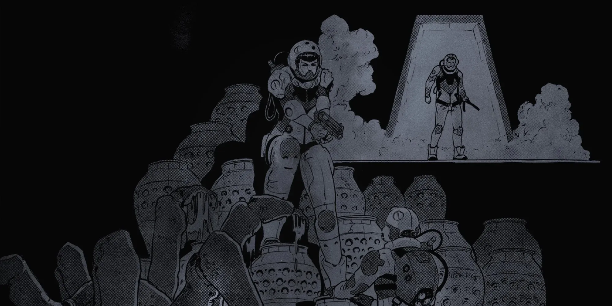

# 3.0 CIVILIZATION

{.splash-banner}

The Known Galaxy is expansive and expensive. Between adventures, contracts, and detours, you may find yourself encountering established and populated settlements, outposts, and satellites, and can find safety for a time among their residents.

## 3.1 PORTS

When characters are in need of a place to repair, refuel, and catch a little R&R, they need to dock at the nearest port. While in port, you can buy and sell equipment, look for work, buy a ticket or charter a vehicle, or take some much needed Shore Leave. 

There are five basic classes of Port based on their safety, importance, and affluence:

1. **X-Class Ports:** Notorious criminal settlements and pirate bases. X-Class Ports are beyond the reach of the Company, making them much more free and much more dangerous. 
2. **C-Class Ports:** Rundown, out-of-the-way outposts, refueling stations, and forward military posts. You can find C-Class Ports on any frontier settlement or Rimspace backworld, minimally staffed and minimally supplied. 
3. **B-Class Ports**: Blue-collar industrial stations and large-scale military installations. B-Class Ports build ships, garrison troops, mine ore, and take care of all the heavy industry required to keep the galaxy spinning. 
4. **A-Class Ports**: Overpopulated metropolises, trading centers, and power brokers. A-Class Ports house millions and contain everything you'd expect to find in a planetside city, and more if you know where to look. 
5. **S-Class Ports**: Luxurious pleasure spas and restricted-access palatial estates of the uber-wealthy. S-Class Ports are the rare gems of the void. Heavily guarded, invite only. 

While Ports are generally locations capable of docking a ship, these classes can be used to designate planetside cities (or even districts or neighborhoods) for the purposes of Shore Leave.

## 3.2 SHORE LEAVE

Surviving on the Rim is tough, but those who do come out even tougher. Between contracts, if they have some extra credits, characters can take Shore Leave and attempt to convert accumulated Stress into improved Saves.

You can take Shore Leave at any relatively safe Port. Characters need something between a long weekend and a two-week vacation (roughly 2d10 days) to benefit from Shore Leave. Any less and you may incur penalties at the Warden's discretion. 

Shore Leave can be as detailed or abstract as your group prefers. You might play out the entire time with different leisure activities, social scenarios, and costs associated with it, or you could just roll once and head out. Groups that like a little buffer between horrific adventures might appreciate the break with some "slice of life" sessions. To take Shore Leave: 

1. **Pay the Shore Leave Costs.** Every port charges a different amount for Shore Leave based on the different amenities and activities it has to offer. 

| PORT | COST | STRESS CONVERTED |
| :---: | :---: | :---: |
| X-CLASS | 1d100×10kcr | 2d10 [+] |
| C-CLASS | 2d10×100cr | 1d5 |
| B-CLASS | 2d10×1kcr | 1d10 |
| A-CLASS | 2d10×10kcr | 2d10 |
| S-CLASS | 2d10×100kcr | All |

2. **Make a Sanity Save.** In order to process Stress into something useful, make a Sanity Save. Example: *Shore Leave at Anarene's Folly…*

- **Success**: Convert some of the Stress into improved Saves & Stats. Each port converts a different amount of Stress as shown in the table. Whatever Stress you don't convert is relieved, setting the character back to Minimum Stress.  
- **Critical Success**: Convert the maximum amount of Stress allowed at that port into improved Saves and/or Stats, and relieve the remainder.  
- **Failure**: Do not convert any Stress, but relieve all Stress, setting the character back to Minimum Stress. Then, gain 1 Stress for failing the Sanity Save.  
- **Critical Failure**: Do not convert or relieve any Stress. Make a Panic Check. 

3. **Convert Stress into Saves and/or Stats.** For every point of Stress you convert, you can improve any Save or Stat by one. You can divide these improvements up however you want.

## 3.3 CONTRACTORS

At most Ports throughout the Rim, you can find broke and hungry freelancers, hitchhikers, pioneers, and mercenaries all looking for work or a ride to the next system. If you find your crew light and in need of extra hands to fulfill a mission or staff a ship, you may want to hire a **Contractor**. Be careful, though, since many contractors can be cutthroat and disloyal, leaving characters to die when you need them the most.

Contractors should generally be controlled by the player who hired them or by any player who doesn't have a character present in the scene currently. This helps keep everyone engaged.

Contractors are much simpler characters than the ones you play, and only have four Stats, which Range from 1–10. When making Checks, they roll 1d10 instead of a 1d100. 

- **Combat**: This is a catch-all Stat for all physical, manual, and combat Checks, showing how good they are in a fight. Contractors will have a Combat of between 1–7.  
- **Instinct**: This is a catch-all Stat for Fear, Sanity, Body, Speed, Smarts, Savvy, and everything else. Contractors will have an Instinct of between 1–5.  
- **Max Wounds**: Contractors don't track their Health per Wound. Instead, any Damage they take counts as a Wound. If they take Wounds equal to their Maximum Wounds, they die.  
- **Loyalty**: Loyalty is a Save, and is rolled whenever the contractor needs to make a decision between what's best for them and what's best for you. On a success they help you out, but on a failure they help themselves out. Each contractor starts with a Loyalty Save of 2+1d5, rolled after they are hired. 

These simplified Stats make Contractors easier to track. Contractors are generally weaker than your characters, and don't last long, so be sure to protect them. Some contractors may also have Skill Bonuses, as determined by the Warden.

### *3.3.1 CONTRACTOR COST*

Contractors are paid a monthly salary at the beginning of every month. Additionally, they usually demand hazard pay (1d5 months of extra pay) any time they engage in any life-threatening danger as a result of the job. Contractor salaries are calculated using the following prices, under normal circumstances: 

| ATTRIBUTE | PRICE | DESCRIPTION |
| :---: | :---: | :---: |
| COMBAT (above 1) | 200cr | +1 Combat Stat |
| INSTINCT (above 1) | 300cr | +1 Instinct Stat |
| WOUNDS (above 1) | 750cr | +1 Max Wound |
| TRAINED SKILL | 300cr | +1 Bonus |
| EXPERT SKILL | 600cr | +2 Bonus |
| MASTER SKILL | 900cr | +3 Bonus |

Non-payment or partial payment results in a Loyalty Save [-]. Finally, Contractors always indicate a beneficiary who seeks any payments owed to them in the event of their death.

Contractors generally have the basic tools, weapons, and armor required to do their job. If necessary, you can roll a Loadout for them to see what they have on them.

### *3.3.2 IMPROVING LOYALTY*

Contractors who survive a job and are paid in full increase their Loyalty by 1. Increases of 1d5 or 1d10 should be reserved for extreme circumstances (like saving the Contractor's life or splitting large paydays with them). 

Not all Contractors need a motivation, but those who do always fail Loyalty Saves when the two come in conflict. A contractor's motivation always supersedes any sense of loyalty to the crew they may have. You don't need to roll up a motivation for every contractor, just notable ones.

### *3.3.3 CONTRACTOR MOTIVATION (D20)*

| D20 | RANDOM MOTIVATION |
| :---: | ----- |
| 01 | Secretly investigating a Corporate cover-up. |
| 02 | Sending money back home to family. |
| 03 | Badly needs to pay off a loan shark. |
| 04 | Can't stop in one place for too long, gets restless. |
| 05 |  Hears a call from an entity they can't explain. |
| 06 | Using you/your ship to smuggle contraband. |
| 07 | Revenge. |
| 08 | Secretly a con artist with no other expertise. |
| 09 | Paying a loved one's medical bills. |
| 10 | Secretly a spy for a rival corporation. |
| 11 | Need to pay off a jumped bail or a court fine. |
| 12 | Undercover secret police investigating your crew. |
| 13 |  In huge debt to a powerful crime syndicate. |
| 14 | Took the money and ran out on their last job. |
| 15 | Family member held hostage, needs ransom. |
| 16 | Secretly a bounty hunter looking for your crew. |
| 17 | Seeking an honorable and glorious death. |
| 18 | Unknowingly contagious with a deadly disease. |
| 19 | Escaped from a corporate research facility. |
| 20 | Secretly a wanted serial killer in hiding. |

