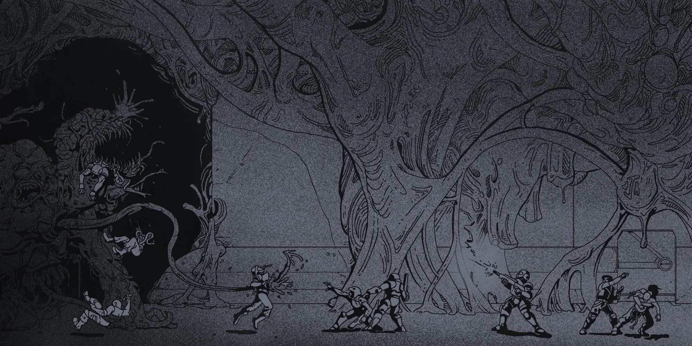

# 2.0 HOW TO PLAY

{.splash-banner}

## 2.1 HOW TO BE A GREAT PLAYER

Mommyship can be a very challenging game. You should expect:

- **Characters to die.** Play smart. Make the most of your time. 
- **Violence to be punishing.** If you're fighting, you're losing. Violence is deadly, and should be avoided at all costs. 
- **The odds to be stacked against you.** Rolls are punishing in Mothership. Find ways to stack the odds in your favor. 
- **To make difficult choices.** Surviving the ordeal, solving the mystery, or saving the day are often mutually exclusive. 
- **To pay attention.** Stay focused and plug into the fictional world. It helps you and everyone else get into the spirit of the game and have a more immersive experience. 
- **A safe play environment.** This is a horror game, and it can deal with many uncomfortable topics. It's your responsibility to make sure you're not making anyone at the table uncomfortable with your words and actions (both in and out of character), and to speak up if you feel uncomfortable or if you notice anyone else might be uncomfortable.

Mommyship is a tabletop roleplaying game. You and your friends get together, and one of you, the Warden, prepares a scenario for the rest of you to explore and interact with. You ask questions, roll some dice, make some jokes, and die a few times.

The rules are simple, but the game is challenging:

- You can attempt to do anything you want, and are not limited by what is on your character sheet. Most things you want to do just happen. 
- You should ask a lot of questions. The more information you have, the less likely you'll have to make risky rolls like Stat Checks and Saves. 
- Stat Checks are made when you want to do something and the price for failure is high. You want to roll low, not high. 
- Saves are reactions, rolled to avoid different mental, emotional, and physical dangers.

When you fail a Stat Check or a Save your character gains 1 or more Stress. Stress can be bad, as it makes characters more likely to Panic, but is also needed to improve Saves.

Panic Checks are rolled when the worst has happened and your character snaps. A bad result can lead to a long-term Condition that needs treatment, but a good result can provide focus when it is needed the most.

When characters get hurt they lose Health. If they lose enough Health they suffer a Wound. If they gain Wounds equal to their maximum they die. 

With these basics in mind, you're ready to handle 90% of the situations that come up in a game. For everything else, you, the Warden, and the other players will discuss the situation and come up with a House Rule to suit the table's specific needs.

### *2.1.1 DICE NOTATION*

There are three ways we notate dice:

- 1d100 means to roll a pair of ten-sided dice, where one die represents the tens digit and the other represents the ones digit. For example: if you roll a 90 and a 9, that equals 99. If you roll a 00 and a 0, that equals a zero. 
- *x*d10 means to roll a number of ten-sided dice (e.g., 1d10, 2d10…) and add them together. 
- *x*d5 means to roll a number of ten-sided dice (e.g., 1d10, 2d10…), add them together, and then divide by half, rounding down (minimum 1). 
- We use a twenty-sided die (1d20) called the Panic Die. You normally use this only to make Panic Checks. 
- If you see [+] next to a roll, it means the roll has Advantage, while [-] means the roll has Disadvantage.

### *2.1.2 PLAYER SUPPLIES CHECKLIST*

Once you've collected all of these items and built your character, you're ready to play!

- The Mommyship Player's Survival Guide 
- Your Character Sheet 
- 1d100 "percentile dice" (a d10 with single digits and another with double digits, rolled together) 
- 1d20 "panic die" 
- Something to take notes with 
- Your imagination and attention

## 2.2 STAT CHECKS & SAVES

### *2.2.1 STAT CHECKS* 

Whenever you want to do something and the price for failure is high, roll 1d100 and attempt to roll lower than your most relevant Stat. This is called a Stat Check. If you roll less than your Stat, you succeed. Otherwise, you fail and gain 1 Stress.

A roll of 90–99 is always a failure, and a roll of 00 is always a critical success.

You have four main Stats which represent your abilities when acting under pressure:

- **Strength:** Holding airlocks closed, carrying fallen comrades, climbing, pushing, jumping, using most melee weapons. 
- **Speed:** Getting out of the cargo bay before the blast doors close, acting before someone (or something) else, running away, using most Ranged weapons. 
- **Smarts**: Recalling your training and experience under duress, thinking through difficult problems, inventing or fixing things. 
- **Savvy**: Swaying people to your cause, judging an uncertain situation, haggling and talking your way out of trouble.

### *2.2.2 SAVES*

In order to avoid certain dangers or trauma, you sometimes need to roll 1d100, aiming for lower than your number in the associated Save. This is called a Save. If you roll less than your Save number, you succeed. Otherwise, you fail and gain 1 Stress. A roll of 90–99 is always a failure.

You have three Saves which represent your ability to withstand different kinds of trauma:

- **Sanity:** Rationalize logical inconsistencies in the universe, make sense out of chaos, detect illusions and mimicry, cope with Stress. 
- **Fear:** Maintain a level head while struggling with fear, loneliness, depression, and other emotional surges. 
- **Body:** Employ quick reflexes and resist hunger, disease, or organisms that might try and invade your insides.

### *2.2.3 MODIFYING ROLLS*

There are three things that can modify the outcome of a Stat Check or Save: Advantage & Disadvantage, Critical Successes & Failures, and Skills.

**Advantage & Disadvantage:** Whenever you are making a roll of any kind (Stat Check, Save, Panic Check, Damage, etc.) and the character has a situational advantage (like assistance from someone else), roll twice and take the best result. When at a situational disadvantage (like poor weather or bad visibility), roll twice and take the worst result.

**[+]/[-] Shorthand:** Advantage is notated with [+], Disadvantage with [-] (e.g., Body Save [+] means make a Body Save with Advantage). If a character has both Advantage and Disadvantage, they cancel each other out.

**Critical Successes & Failures:** Whenever you roll doubles (e.g., 00, 66) on a Stat Check or Save, you have rolled a Critical. If the roll is a success, it is now a Critical Success and something very good happens. If it is a failure, it is now a Critical Failure and something bad happens, and furthermore, you must make a Panic Check. A roll of 00 is always a Critical Success and a roll of 99 is always a Critical Failure.

**Skills:** If a character has a Skill that is relevant to the task at hand, you can add the Skill's bonus to the Stat or Save before making your roll (giving you a higher number to roll under and thus a greater chance of success).

## 2.3 STRESS

The unknown horrors of the cosmos and the vast emptiness of space take a toll on a person. Stress is a measure of that toll, and how it subtly affects you, bringing you closer to the brink of Panic. While Stress by itself doesn't do anything, the higher your Stress is, the more likely you are to Panic, and the more Stress you have when you Panic, the worse your Panic is likely to be.

### *2.3.1 WHEN DO I GAIN STRESS?*

You gain 1 Stress every time you fail a Stat Check or Save. Occasionally, certain locations or entities can automatically give you Stress from interacting with or witnessing them. Your Minimum Stress starts at 2, and based on events that happen in game, such as certain Panic Check results, it can be increased or decreased. The maximum Stress you can have is 20. Any Stress you take over 20 instead reduces the most relevant Stat or Save by that amount.

### *2.3.2 HOW DO I RELIEVE STRESS?*

You can relieve Stress by resting in a relatively safe place. To do this, make a Rest Save using your worst Save. If you succeed, reduce your Stress by the ones digit rolled (e.g., if you rolled 24 under your worst Save of 30, reduce your Stress by 4). If you fail, you gain 1 Stress instead.

Players can gain Advantage on their Rest Save by participating in consensual sex, recreational drug use, a night of heavy drinking, prayer, or any other suitable leisure activity. Unsafe locations may impose Disadvantage on Rest Saves at the Warden's discretion. Stress is typically not relieved during cryosleep. Finally, if you have more time, you can take Shore Leave and convert your Stress into improved Saves.

## 2.4 PANIC

Stress, Damage, and emotional wear and tear eventually bring characters to their breaking point. When that happens, there's a chance they Panic. You determine this by making a Panic Check.

### *2.4.1 WHAT IS A PANIC CHECK?*

A Panic Check determines whether the character can keep their cool under extreme pressure. To make a Panic Check, roll the Panic Die (1d20) and attempt to roll greater than your current Stress. If you roll less than or equal to your current Stress you fail, and you look up your result on the Panic Table below.

### *2.4.2 WHEN TO MAKE PANIC CHECKS*

You must make a Panic Check anytime you roll a Critical Failure on a Stat Check or Save. Additionally, the Warden may call for a Panic Check at any other appropriate time, including but not limited to:

- Watching another crewmember die. 
- Witnessing more than 1 crewmember Panic at the same time. 
- Whenever your Ship rolls a Critical Failure, everyone on board makes a Panic Check. 
- Encountering a strange and horrifying entity for the first time. 
- When all hope is lost and death feels certain. 
- Whenever you, the player, want.

Some results of the Panic Table are so severe that they leave a lasting impression on you. These are called **Conditions**, and they affect you until you are able to treat them.

### *2.4.3 PANIC TABLE (D20)*

| D20 | EFFECT |
| :---: | ----- |
| 01 | **ADRENALINE RUSH.** [+] on all rolls for the next 2d10 minutes. Reduce Stress by 1d5. |
| 02 | **NERVOUS.** Gain 1 Stress. |
| 03 | **JUMPY.** Gain 1 Stress. All Close crewmembers gain 2 Stress. |
| 04 | **OVERWHELMED.** [-] on all rolls for the next 1d10 minutes. Increase Minimum Stress by 1. |
| 05 | **COWARD.** Gain a new Condition: You must make a Fear Save to engage in violence, otherwise you flee. |
| 06 | **FRIGHTENED.** Gain a new Condition: When Encountering what frightened you, make Fear Save [-] or gain 1d5 Stress. |
| 07 | **NIGHTMARES.** Gain a new Condition: Sleep is difficult, [-] on Rest Saves. |
| 08 | **LOSS OF CONFIDENCE.** Gain a new Condition: Choose one Skill and lose its bonus. |
| 09 | **DEFLATED.** Gain a new Condition: Whenever a Close crewmember fails a Save, gain 1 Stress. |
| 10 | **DOOMED.** Gain a new Condition: You feel cursed and unlucky. All Critical Successes are instead Critical Failures. |
| 11 | **SUSPICIOUS.** For the next week, whenever someone joins the crew (even temporarily), make a Fear Save or gain 1 Stress. |
| 12 | **HAUNTED.** Gain a new Condition: Something starts visiting your character at night. In their dreams. Out of the corner of their eye. And soon it will start making demands. |
| 13 | **DEATH WISH.** For the next 24 hours, whenever you encounter a stranger or known enemy, make a Sanity Save or immediately attack them.    |
| 14 | **PROPHETIC VISION.** Your character immediately experiences an intense hallucination or vision of an impending terror or horrific event. Increase Minimum Stress by 2.    |
| 15 | **CATATONIC.** Your character becomes unresponsive and unmoving for 2d10 minutes. Reduce Stress by 1d10. |
| 16 | **RAGE.** [+] on all Damage rolls for the next 1d10 hours. All crewmembers gain 1 Stress. |
| 17 | **SPIRALING.** Gain a new Condition: Panic Checks are at [-]. |
| 18 | **COMPOUNDING PROBLEMS.** Roll again on this table and increase your Minimum Stress by 1. |
| 19 | **VITAL FAILURE.** Reduce Maximum Wounds by 1. Gain [-] on all rolls for 1d10 hours. Increase Minimum Stress by 1. |
| 20 | **RETIRE.** You're not cut out for this rambling lifestyle anymore. Roll up a new character to play. |

## 2.5 SKILLS

Skills represent the accumulated knowledge, craft, techniques, and training a character possesses in a certain field. Whenever you make a Stat Check or Save and you have a relevant Skill, you add your Skill Bonus to your Stat or Save, giving you a higher number to roll under.

Each class starts with a few Skills, and characters can acquire more through long-term study, rigorous Skill Training, expensive enhancement implants, and from some Patches.

Just because you don't have a Skill doesn't mean you don't know anything about the subject, and it usually doesn't mean you can't at least make an attempt. What it means is that you don't have significant enough experience or expertise in the matter to act decisively in high pressure situations. Therefore, you get no bonus, and depending on how complex the task is, you might roll with Disadvantage (or not be able to attempt it at all).

### *2.5.1 TRAINED SKILLS (+10)*

You've received standard training in this area equivalent to a bachelor's degree or on-the-job training for a couple years.

- **Art:** The expression or application of a species' creative ability and imagination. 
- **Athletics:** Physical fitness, sports, and games.
- **Botany:** The study of plant life. 
- **Chemistry:** The study of matter and its chemical elements and compounds. 
- **Computers:** Fluent use of computers and their networks. 
- **First Aid:** Basic medical care for everyday injuries. 
- **Geology:** The study of solid features of any terrestrial planet or its satellites. 
- **History:** The study of past events, commerce, political entities and military operations.
- **Industrial Equipment:** The safe and proper use of heavy machinery and tools (exosuits, forklifts, drills, breakers, laser cutters, etc). 
- **Influence:** Interpersonal sway, ability to read social cues and respond accordingly.
- **Jury-rigging:** Makeshift repair or engineering, using only the tools and materials at hand. 
- **Linguistics:** The study of languages (alive, dead, and undiscovered). 
- **Mathematics:** The study of numbers, quantity, and space. 
- **Military Training:** Basic training provided to all military personnel. 
- **Psychometry:** The ability to gain information about a person, place, or thing without tangible evidence. 
- **Rimwise:** Practical knowledge and know-how regarding Outer Rim colonies, their customs, and the seedier parts of the galaxy. 
- **Theology:** The study of the divine or devotion to a religion. 
- **Zero-G:** Practice and know-how of working in a vacuum, orientation, vaccsuit operation, etc. 
- **Zoology:** The study of animal life.

### *2.5.2 EXPERT SKILLS (+15)*

You've received the equivalent of a doctorate or have many years of experience in this field. Expert Skills should generally be a subset or specific focus of a Trained Skill. 

- **Archeology:** The study of ancient cultures and artifacts.
    - **Requires:** History
- **Asteroid Mining:** Training in the tools and procedures used for mining asteroids.
    - **Requires:** Geology or Industrial Equipment
- **Ecology:** The study of organisms and how they relate to their environment.
    - **Requires:** Botany or Geology
- **Explosives:** Design and effective use of explosive devices (bombs, grenades, shells, land mines, etc.)
    - **Requires:** Jury-Rigging, Chemistry, or Military Training
- **Extortion:** Application of sensitive financial, emotional, or legal information to assert pressure on a person/entity to solicit their cooperation or a specific course of action. 
    - **Requires:** Influence
- **Field Medicine:** Emergency medical care and treatment for moderate injuries.
    - **Requires:** First Aid or Zoology
- **Firearms:** Safe and effective use of guns.
    - **Requires:** Military Training or Rimwise
- **Hacking:** Unauthorized access to computer systems and networks.
    - **Requires:** Computers or Military Training
- **Hand-to-Hand Combat:** Melee fighting, brawling, martial arts, etc.
    - **Requires:** Rimwise or Athletics
- **Mechanical Repair:** Fixing broken machines.
    - **Requires:** Industrial Equipment or Jury-Rigging
- **Mysticism:** Spiritual apprehension of hidden knowledge.
    - **Requires:** Art, History, or Theology
- **Parkour:** Quick & precise traversal of unusual terrain, often involving acrobatics.
    - **Requires:** Athletics
- **Pathology:** Study of the causes and effects of diseases.
    - **Requires:** Zoology, First Aid, or Botany
- **Pharmacology:** Study of drugs and medicine.
    - **Requires:** Chemistry
- **Physics:** Study of matter, motion, energy, and their effects in space and time.
    - **Requires:** Mathematics
- **Piloting:** Operation and control of aircraft, spacecraft, and other vehicles.
    - **Requires:** Zero-G or Military Training
- **Psychology:** The study of behavior and the human mind.
    - **Requires:** Linguistics, Zoology, Psychometry, or Influence
- **Somapathy:** The assertion or extraction of mental information, emotions, moods to or from intelligent creatures.
    - **Requires:** Psychometry
- **Wilderness Survival:** Applicable know-how regarding the basic necessities of life (food, water, shelter) in a natural environment.
    - **Requires:** Military Training or Botany

### *2.5.3 MASTER SKILLS (+20)*

You are advanced in your field and are aware of cutting edge techniques or highly specialized and niche information. Due to their focus, Master Skills apply very narrowly compared to Trained Skills. 

- **Artificial Intelligence:** The study of intelligence as demonstrated by machines.
    - **Requires:** Hacking
- **Artillery:** The effective use of vehicle hardpoint weapons or other heavy-duty military hardware.
    - **Requires:** Firearms or Explosives
- **Bioweaponry:** The study of weaponizing biological factors against organic lifeforms.
    - **Requires:** Pharmacology
- **Command:** Leadership, management, and authority.
    - **Requires:** Firearms or Piloting
- **Cybernetics:** The physical and neural interfaces between organisms and machines.
    - **Requires:** Mechanical Repair or Hacking
- **Engineering:** The design, building, and use of engines, machines, and structures.
    - **Requires:** Mechanical Repair
- **Exobiology:** The study of and search for intelligent alien life.
    - **Requires:** Pathology
- **Hyperspace:** Faster-than-light travel.
    - **Requires:** Physics
- **Infiltration:** Avoiding suspicion or notice, navigating foreign and enemy systems, impersonating a particular individual or a general position.
    - **Requires:** Extortion or Parkour
- **Neurocombat:** Fighting focused on disruption of the nervous system or mental faculties.
    - **Requires:** Hand-to-Hand Combat or Psychology
- **Planetology:** The study of planets and other celestial bodies.
    - **Requires:** Ecology
- **Psychokinesis:** Manipulation of physical matter mentally or psychically.
    - **Requires:** Somapathy or Mysticism
- **Robotics:** Design, maintenance, and operation of robots, drones, and androids.
    - **Requires:** Mechanical Repair
- **Sophontology:** The study of the behavior and mind of inhuman entities.
    - **Requires:** Psychology or Archaeology
- **Surgery:** Manually operating on living or dead biological subjects.
    - **Requires:** Field Medicine or Pathology
- **Xenoesotericism:** Obscure beliefs, mysticism, and religion regarding non-human entities.
    - **Requires:** Mysticism

### *2.5.4 SKILL TRAINING*

To learn a new Skill the old-fashioned way, you need to spend the requisite amount of time and credits:

- **Trained Skills:** 2 years + 10kcr in materials. 
- **Expert Skills:** 4 years + 50kcr in materials. 
- **Master Skills:** 6 years + 200kcr in materials.

To train an Expert Skill requires one Trained Skill prerequisite and to train a Master Skill requires one Expert Skill prerequisite. 

**Why does it take so long?** Skill Training assumes characters are working full time, going on missions, and generally living life. If studying full-time (e.g., by going to school), then training takes half as long.

**Training Shortcuts:** If that time commitment is still too daunting, there are shortcuts to be found: cyberware, neuromods, software patches, experimental procedures, etc. To purchase these, the base cost of the given Skill is 5× the standard training cost, and you must take Shore Leave of at least 2 weeks to have the upgrade installed/implanted. 

Upon completion of this Shore Leave, you will make a Save relevant to the Skill you are training in. For a Trained Skill, make this roll with [+]. For a Master Skill, make this roll with [-]. The result of this Save will determine the outcome of your procedure.

- **Success:** You gain the Skill, and have [-] to rolls using it for 1d10 days. 
- **Critical Success:** You gain the Skill with no side effects. 
- **Failure:** You gain the Skill, and have [-] to rolls using it for 1d100 days. 
- **Critical Failure:** You reject the upgrade. Take a Wound, and do not gain the Skill. 

## 2.6 VIOLENT ENCOUNTERS

Violence in Mommyship is incredibly dangerous, and should be avoided at all costs. When all else fails, this is how to resolve the encounter. 

### *2.6.1 TURN ORDER*

During a violent confrontation, time is split into roughly 10 second intervals called rounds. Everything within a round happens at basically the same time. The Warden describes the situation and what is likely to happen if no response, then play goes around the table and each player describes how their characters react. As usual, feel free to ask questions, and the Warden answers and explains the likely consequences of failure.

Once you understand the stakes and what you want to do, you commit to a course of action, either individually or as a group. Once everyone has done this, the Warden resolves everyone's actions at once, assigning any necessary Stat Checks or Saves. Then, everyone who has to, rolls. 

After any Stat Checks and Saves are rolled, if anyone is taking Damage or a Wound, those are rolled. Finally, the Warden describes the new situation, and the next round starts. This repeats until the encounter is resolved.

If there is a chance that characters are ambushed or stunned by a horrific encounter, the Warden calls for a Fear Save. Those who succeed are able to react, those who fail are too shocked to react until the next round.

**OPTIONAL RULE:** *Strict Turn Order* 
Some groups prefer a very strict turn order. If this is the case for your group, we recommend everyone make a Speed Check at the start of the encounter. Those who succeed go before the enemy hostiles, and those who fail go after. If the situation changes dramatically (e.g., if new hostiles enter the encounter or the environment is significantly altered), Speed Checks can be called for again.

### *2.6.2 WHAT CAN I DO?*

Characters can generally move somewhere within Close Range and then do one thing before the situation changes. Think of the situation like a real life scenario. Think about what you would do in those circumstances, then describe that to the Warden. If you can't accomplish everything you want to do in one round, or your choices are especially foolhardy or dangerous, the Warden will do their best to let you know and explain the risks involved.

Here's a non-exhaustive list of the kinds of things you could attempt in a round:

- Attack something or someone. 
- Bandage a wound to try and stop the bleeding. 
- Check vital signs with a medscanner. 
- Move again. 
- Fire a vehicle's weapon. 
- Maneuver or pilot a vehicle. 
- Open an airlock. 
- Operate a machine. 
- Reload a weapon. 
- Throw something at or to someone. 
- Use a computer terminal (to search a directory, engage automatic airlocks, send a distress signal, cycle through CCTV cameras, disable Life Support, etc.).

Additionally, if you decide to do nothing other than run, you can move somewhere within Long Range during the round.

### *2.6.3 HOW DO I ATTACK?*

How you attack most often depends on what you are using to attack. For most Ranged weapons, make a Speed Check. For most melee weapons, make a Strength Check. If successful, roll the weapon's Damage and subtract it from the enemy's Health. If you fail, the situation gets worse and you gain 1 Stress.

All weapons have Traits assigned to them, specifying which Stat is used in combat. There are four weapon Traits: 

- **Light:** These weapons use Speed in combat. 
- **Heavy:** These weapons use Strength in combat. 
- **Tech:** These weapons use Smarts in combat. 
- **Psychic:** These weapons use Savvy in combat.

### *2.6.4 DAMAGE*

When taking Damage (DMG), subtract it from your Health. If your Health reaches zero, gain a Wound and roll on the Wounds Table. Then, reset the character's health to its Maximum and subtract any carryover damage. Once your character suffers their Maximum Wounds, make a Death Save.

### *2.6.5 ARMOR*

While wearing armor, you are shielded from damage under your current Armor Points (AP). Any hits you suffer that deal damage less than your AP instead deal no damage to you.

When you suffer damage higher than your current AP value (per hit), subtract your AP from the damage, and your armor gets -1 to its AP until you can repair it. This penalty can stack, and armor breaks completely at 0 AP. Different armor requires different resources and tools for repair. 

Anti-Armor weapons/attacks ignore armor's damage reduction and reduce any worn armor's AP by 1, and breaks the armor as normal when it reaches 0 AP.

### *2.6.6 COVER*

The environment can provide protection called Cover. It can be destroyed, just like armor, whenever it is dealt Damage greater than or equal to its AP. Cover typically only protects against Ranged attacks, but in some situations may help block a hand-to-hand attack. If you shoot while in Cover, you are considered out of Cover until your next turn. Cover functions similarly to Armor, except it cannot be repaired during the course of usual combat.

- **Insignificant Cover:** Wood furniture & door, body shields, etc…AP 5. 
- **Light Cover:** Trees, bulkhead walls, metal furniture, etc…AP 10.    
- **Heavy Cover:** Airlock doors, cement beams, ships, etc…AP 20.

### *2.6.7 WOUNDS & DEATH*

When gaining a Wound, roll 1d10 on the Wounds Table according to the type of Damage:

- **Blunt Force:** Getting punched, hit with a crowbar or a thrown object, falling, etc. 
- **Bleeding:** Getting stabbed or cut. 
- **Gunshot:** Getting shot by a firearm. 
- **Fire & Explosives:** Grenades, flamethrowers, doused in Fuel and lit on fire, etc. 
- **Gore & Massive:** Giant or gruesome attacks.

Use the Severity column (and common sense) as a guide. Flesh Wounds are small inconveniences. Minor/Major Injuries cause lasting issues which require medical treatment. Lethal Injuries can kill you if not dealt with immediately. Fatal Injuries can kill outright. Bleeding wounds, if not treated, can quickly overwhelm you. 

Some attacks deal Wounds directly (bypassing any Armor).

**Death Saves:** These are separate from normal Saves, despite sharing some nomenclature. If your death seems imminent, make your last moments count: save someone's life, solve an important mystery, give the others time to escape.

When you die, the Warden makes a Death Save by placing 1d10 in a cup, shaking the cup, and placing it face down on the table (covering the die). As soon as someone spends a turn checking your vitals, the die is revealed and the roll is looked up on the Death Table below. Use common sense.

| D10 | RESULT |
| :---: | ----- |
| 00 | **You are unconscious.** You wake up in 2d10 minutes. Reduce your Maximum Health by 1d5. |
| 01–02 | **You are unconscious and dying.** You die in 1d5 rounds without intervention. |
| 03–04 | **You are comatose.** Only extraordinary measures can return you to the waking world. |
| 05–09 | **You have died.** Roll up a new character. |

### *2.6.8 WOUND EFFECTS (D10)*

| D10 | SEVERITY | BLUNT FORCE | BLEEDING | GUNSHOT | FIRE & EXPLOSIVES | GORE & MASSIVE |
| :---: | :---: | :---: | :---: | :---: | :---: | :---: |
| 00 | Flesh Wound | Winded. [-] until you catch your breath. | Drop held item. | Grazed, knocked down.    | Hair burnt. Gain 1d5 Stress. | Vomit [-] on next action. |
| 01 | Minor Injury | Black Eye. [-] on Savvy Checks. | Loss of blood. Those Close gain 1 Stress. | Bleeding +1 | Awesome Scar. +1 Min. Stress. | Awesome Scar. +1 Min. Stress. |
| 02 |    | Bell rung. [-] on Smarts Checks. | Blood in eyes. [-] until wiped clean.    | Fractured extremity. [-] on next Speed Check. | Singed. [-] on next action. | Digit mangled. |
| 03 |    | Leg or foot broken. [-] on Speed Checks. | Laceration. Bleeding +1 | Broken rib. If relying on limited oxygen supply, depletes at 2× rate. | Shrapnel/large burn. [-] on next 1d5 actions.    | Eye gouged out. |
| 04 |    | Snapped collarbone. [-] on Strength Checks. | Major cut. Bleeding +2 | Fractured extremity. -1 AP. | Extensive burns. -1d10 Strength. | Ripped off flesh. -1d10 Strength. |
| 05 | Major Injury | Concussion. Lose use of all Skills. | Fingers/toes severed. Bleeding +3 | Lodged bullet. Surgery required. | Major Burn. -2d10 Body Save. | Paralyzed from the waist down. |
| 06 |    | Rupture. -1d5 AP. | Hand/foot severed. Bleeding +4 | Gunshot to the neck. Bleeding +3 | Traumatic Burn. -2d10 Fear Save. | Limb severed. Bleeding +5. |
| 07 | Lethal Injury (Death Save in 1d10 rounds) | Back broken. [-] on all Checks. | Limb severed. Bleeding +5 | Major blood loss. Bleeding +4 | Limb on fire. 2d10 DMG per round. | Impaled Bleeding +6.    |
| 08 |    | Skull fracture. [-] on all Saves. | Major artery cut. Bleeding +6 | Sucking chest wound. Bleeding +5 | Body on fire. 3d10 DMG per round. | Guts spooled on floor. Bleeding +7.    |
| 09 | Fatal Injury (Death Save now) | Spine or neck broken. Death Save. | Throat slit or heart pierced. Death Save. | Headshot. Death Save. | Engulfed in a fiery explosion. Death Save. | Head explodes. No Death Save. You have died. |

### *2.6.9 RANGE & DISTANCE*

Range, distance, and movement are tracked abstractly in Range Bands. These are: 

- **Adjacent:** Less than 1m/3ft. You're basically touching. This covers fist fights, close-quarters combat, and trying to get out of the grips of a hideous terror's claws. More than that, it covers things like using a computer terminal or administering first aid to someone. You can talk comfortably, whisper, and even smell someone at this Range. 
- **Close Range:** Roughly 5–10m/15–30ft. Someone Close can be reached by running over to them in a few seconds. They're near enough that you could likely throw something at them and hit them. You'd have to speak loud enough that someone on the other side of the room could hear you. Powerful stenches can be smelled if they're Close. Firearms like shotguns are most effective at this Range or Adjacent. 
- **Long Range:** Roughly 20–100m/50–300ft. Things in this band are far enough away that they take an entire round or longer to get to. Rifles are effective at this Range, but handguns and shotguns less so. You'd have to yell at someone to get their attention, and you probably won't smell anyone at Long Range, no matter how bad they stink. 
- **Extreme Range:** More than 100m/300ft. Only the longest Range weapons, like smart rifles, can hit something accurately in this band. It takes more than one turn to get to something here, and even if you hear a scream you might not know which direction it's coming from.

Describing distance should be done in human casual terms. What's important is whether someone can touch you, whether they can get to you, whether you can shoot them, or whether you can't.

## 2.7 SURVIVAL

Below are some of the most common afflictions characters may encounter while exploring space.

### *2.7.1 ATMOSPHERES*

Planets with Toxic or Corrosive atmospheres require special gear to explore, otherwise there is the risk of harm or even death. 

**Toxic Atmosphere:** The planet's atmosphere is not fit to breathe, but is otherwise safe. A rebreather or armor with its own oxygen supply is required. Without these, characters take 1d10 DMG per round, Body Save for half. 

**Corrosive Atmosphere:** The planet's atmosphere is deadly and destructive. It deals Damage every round while on it. This Ranges from 1 DMG / round (Mildly Corrosive) to 10 DMG / round (Highly Corrosive). Anything higher is simply impossible to safely traverse without specialized equipment and armor. 

### *2.7.2 BLEEDING*

Some weapons or Wounds cause characters to Bleed. This means they take 1 Damage every round until the bleeding is stopped. This is cumulative. If a character is bleeding 1 Damage per round and gains Bleeding +1, they now take 2 Damage per round. Bleeding damage ignores armor and damage reduction.

### *2.7.3 CRYOSICKNESS*

To endure long space journeys or hyperspace jumps, crews use cryopods, which are coffin-like capsules that freeze them in a suspended animation called cryosleep. While in cryosleep, vitals are preserved and aging slows down. However, upon awakening, you experience a hangover-like feeling called cryosickness, which causes sluggishness and slow reflexes. While cryosick, you suffer [-] on all rolls for 1 week. Upgraded cryochambers can help mitigate these effects, and a stimpack can cure them instantly.

### *2.7.4 EXHAUSTION*

Long grueling treks on undiscovered planets can easily grind you down. If it becomes relevant, track exhaustion by making a Body Save every hour after 12 hours of activity. Upon failure, gain 1 Stress and take 1 Damage.

After 24 hours of exhaustion, you suffer [-] on all rolls until the character can rest for 8 hours.

### *2.7.5 FOOD & WATER*

Humans can survive roughly 3 weeks without food. After 24 hours without food, roll at Disadvantage to all rolls. For the bare minimum of survival you need 1 liter of water a day. However, at this level, any strenuous activity (e.g., running, combat, making mechanical repairs) forces you to make a Body Save or pass out. When water is scarce and you're tracking it this closely, you're at Disadvantage on all rolls. 

### *2.7.6 OXYGEN*

In space, you can last 15 seconds without oxygen before falling unconscious. After passing out, you can survive for 1d5 minutes before dying. 

If all of a ship's Life Support System goes offline, roll 1d10 and multiply it by the maximum crew capacity. This is the remaining oxygen supply. 

Every 24 hours, subtract the total number of breathing crewmembers from the remaining oxygen supply. Any crewmembers engaging in strenuous activity (e.g., running, combat, mechanical repairs, etc.) further reduce the oxygen supply by 2 each. 

Whenever the oxygen supply is less than twice the amount of breathing Passengers, all rolls are at Disadvantage as the crew suffers headaches, fatigue, anxiety, and general clumsiness. 

Whenever the oxygen supply is less than the total amount of breathing Passengers, every breathing Passenger must make a Body Save or else make a Death Save as they suffer panting, dizziness, severe headaches, impaired vision and tinnitus. 

Once the oxygen supply runs out, you can survive for 15 seconds before you fall unconscious. After falling unconscious, you can survive for 1d5 minutes without oxygen before dying. 

Mechs and those in cryosleep do not consume the oxygen supply.

### *2.7.7 RADIATION*

Whether it's cosmic rays, an engine leak, or some previously undiscovered asteroid ore, radiation can kill you if you're not careful. There are three levels of radiation exposure: 

| LEVEL | DAMAGE |
| :---: | :---: |
| 1 — **TRACE** Normal, everyday radiation. Cosmic rays. | None immediately. Possible long-term side effects include cancer. |
| 2 — **ACUTE** Unshielded reactors and Warp Cores. | Reduce all Stats and Saves by 1 every round. |
| 3 — **LETHAL** Atomic weapons, direct handling of Warp Cores. | Every round, Body Save or lethal dose (death in 1d5 days). |

Armor with Radiation Shielding (such as the Hazard Suit) blocks all three levels of radiation.

### *2.7.8 CHEM OVERDOSE*

Excessive use of stimpacks and other dangerous drugs (Chems) carries a risk of overdose. Whenever a character takes more than one Chem in a day, roll 1d10. If you roll under the amount of doses taken in the past 24 hours, make a Death Save. 

### *2.7.9 TEMPERATURE*

In most cases, a hot climate or a cold climate has no notable effects. However, in places of extreme cold or heat, you should make Body Saves every hour or succumb to the Extreme Cold/Heat. 

**Extreme Cold:** In sub-zero temperatures hypothermia and frostbite can set in within 10–30 minutes for those not dressed appropriately. To survive you must bring your body up to its normal temperature. Hypothermia can kill within 30 minutes to 6 hours. 

**Extreme Heat:** Extreme heat over 100ºF/40ºC can cause heat stroke and kill within hours. Victims must move to a cooler location immediately to get their temperature down.

## 2.8 MEDICAL CARE

No matter how careful you are, sooner or later you are going to get hurt. Minor injuries can usually be treated with a quick rest, but Wounds and Conditions require professional treatment.

### *2.8.1 SHORT TERM RECOVERY*

Once per day, whenever resting, a character's body attempts to heal itself naturally. After 6+ hours of rest make a Body Save. If successful, reset Health to its Maximum. Wounds, however, remain the same.

### *2.8.2 LONG TERM RECOVERY*

Recovering Wounds, Conditions, or losses to Stats and Saves takes a longer time. See the Medical Expenses table for a non-comprehensive list of available treatments.

### *2.8.3 MEDICAL TREATMENTS* 

| TREATMENT | COST | DESCRIPTION |
| :---: | :---: | :---: |
| Artificial Wellness Counselor | 150cr |    1-hour session (max 1 per week) restores 1 Sanity Save. 1% chance you gain a random Condition. |
| Cognitive Defragmentation | 100kcr | 24-hour surgical treatment removes 1 Condition. 1% chance of total amnesia. [-] on Smarts Checks, Sanity Saves, and Fear Saves for 4 weeks. |
| Deep Tissue Nanogel Massage | 24kcr |    1-hour session (max 1 per week) reduces Minimum Stress by 1. [-] on all actions for 24 hours. |
| Immersive Slicksim Therapy | 1kcr | 4-hour virtual treatment restores either 1d10 Sanity or 1d10 Fear Save. 1% chance the character is stuck in the immersion for 1d10 days and loses 1d5 Body Save. |
| Medpod Isolation | 6kcr | Week-long treatment (spent in the pod) restores 1 Wound. Does not restore lost limbs/digits. |
| Pseudoflesh Injection | 18kcr | 8-hour surgical treatment. Restores either 2d10 Speed, 2d10 Strength, 2d10 Body Save, or all Wounds. At [-] on all rolls for 2 weeks, plus an additional 4 weeks of convalescent recovery required. |
| Psychosurgery | 28kcr |    8-hour surgical treatment restores either Smarts, Sanity Save, or Fear Save to their maximum, or reduces Minimum Stress to 2. At [-] on all rolls for 4 weeks. |

