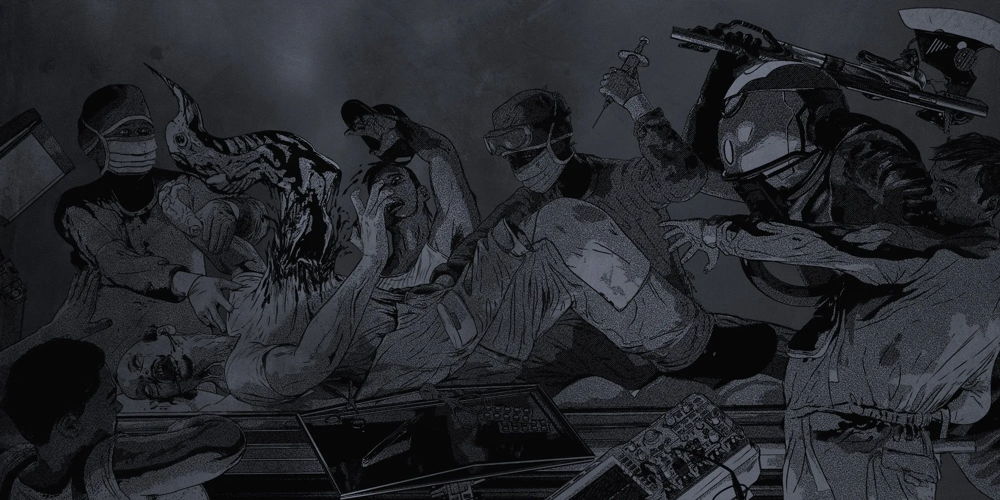

# 1.0 MAKING YOUR CHARACTER

{.splash-banner}

Welcome to Mommyship, the sci-fi horror RPG where you and your crew try to survive in the most inhospitable environment in the universe: outer space! Excavate dangerous derelict spacecraft, explore strange unknown worlds, encounter hostile alien life, and escape the horrors encroaching upon your every move. Let's get started!

The provided character sheet has all the instructions for how to create your character. All you need to do is follow the numbered steps in each box until you've filled everything in.

<a href="../../assets/images/MommyshipSpacerSheet-DARK.png" download="MommyshipSpacerSheet-DARK.png" class="sheet-download">Download Dark Sheet</a>

<a href="../../assets/images/MommyshipSpacerSheet-LIGHT.png" download="MommyshipSpacerSheet-LIGHT.png" class="sheet-download">Download Light Sheet</a>

## 1.1 ROLL STATS

Characters have four Stats: **Strength, Speed, Smarts,** and **Savvy,** representing how well they act under pressure.

Roll 2 ten-sided dice (2d10), add them together, then add 25. Repeat this three more times to come up with 4 stat numbers, which you may then assign freely to **Strength, Speed, Smarts,** and **Savvy.**

A stat of 36 is average, but don't get too hung up on the numbers right now.

## 1.2 ROLL SAVES

Characters have three Saves: **Sanity, Fear,** and **Body,** representing how resistant and reactive they are to different kinds of trauma and danger.

Roll 2 ten-sided dice (2d10), add them together, then add 10. Repeat this two more times to come up with 3 stat numbers, which you may then assign freely to **Sanity, Fear,** and **Body.**

## 1.3 ROLL HEALTH

Characters can suffer a maximum number of **Wounds** before they die. Characters gain a Wound when their **Health** reaches zero.

Roll 1d10, then add 10. Record the result as your **Maximum Health.**

## 1.4 GAIN STRESS

Characters' current **Stress** and **Minimum Stress** both start at 2.

## 1.5 SELECT YOUR SPECIES

Characters each have a specific **Species,** which further modify their Stats, Saves, Health, and Wounds. Each Species also deals with Stress and **Panic** differently, which comes into play later in the game, and has another unique trait. Mark your unique **Trauma Response** for future reference.

There are three Species options, as detailed here:

**Alien**
:   Intelligent life comes in all shapes, sizes, forms, and phenotypes.

    - +10 to 1 Stat
    - +5 to 1 other Stat
    - +30 Body or Sanity Save
    - **Trauma Response:** Whenever you fail a Sanity Save, all Close friendly players gain 1 Stress.
    - **Adaptable:** Your physiology is dictated by your homeworld's environment. Choose 1 Survival immunity: Toxic/Corrosive Atmospheres, Cryosickness, Radiation, Extreme Cold, Extreme Heat. Additionally, your funky biology is resilient in unexpected ways — you have Advantage on all your Wounds Table rolls.

**Human**
:   Basic, sturdy, plentiful, and stubborn.

    - +10 Savvy
    - +10 to all Saves
    - +1d5 Max Health
    - **Trauma Response:** Whenever you Panic, all Close friendly players must make a Fear Save.
    - **Reliable:** Once per in-game day when you fail a Stat Check or Save, you can choose to succeed instead.

**Mech**
:   Superior by design (and also subservient).

    - +10 Smarts or Strength
    - +60 Fear Save
    - +1 Max Wound
    - **Trauma Response:** Whenever you fail a Fear Save, Fear Saves made by Close friendly players have Disadvantage until the threat is dispatched.
    - **Durable:** You are immune to the dangerous vacuum of space, don't require oxygen, and make Saves with Advantage when installing Skill implants (Shore Leave still required).

## 1.6 SELECT YOUR CLASS

Classes broadly define your characters' backgrounds and assign **Skills** your character has experience with.

Mark your class, and select your Skills accordingly. Each class comes preloaded with relevant Skills, which help
characters perform better at different challenges. Additionally, each class has a number of bonus Skills to select.

To choose a Skill, you must have at least one prerequisite Skill (a Skill that has an arrow pointing from it) first.

There are eight class options, as detailed here:

1. **Adherent**: Theology, Mysticism.
     - **Bonus:** 1 Expert Skill with prerequisite & 1 Trained Skill.

2. **Agent**: Computers, Hacking, Influence.
     - **Bonus:** 1 Expert Skill with prerequisite & 1 Trained Skill.

3. **Marine**: Military Training, Athletics, Firearms OR Hand-to-Hand Combat
     - **Bonus:** 1 Expert Skill with prerequisite or 2 Trained Skills.

4. **Psion**: Psychokinesis with prereqs.
     - **Bonus:** 1 Trained Skill.

5. **Scientist**: Any Master Skill with prereqs, except: Command, Psychokinesis, Infiltration.
     - **Bonus:** 1 Trained Skill.

6. **Scum**: Rimwise, Hand-to-Hand Combat OR Firearms.
     - **Bonus:** 3 Trained Skills.

7. **Teamster**: Industrial Equipment, Zero-G.
     - **Bonus:** 1 Expert Skill with prerequisite & 1 Trained Skill.

8. **Virtuoso**: Art, Influence, Linguistics.
     - **Bonus:** 1 Expert Skill with prerequisite.

## 1.7 ROLL FOR GEAR

Roll for a **Loadout** based on your character's class.

| D10 | ADHERENT                                                                                                         | AGENT                                                                                                               | MARINE                                                                                                                    | PSION                                                                                                             |
| :-: | ---------------------------------------------------------------------------------------------------------------- | ------------------------------------------------------------------------------------------------------------------- | ------------------------------------------------------------------------------------------------------------------------- | ----------------------------------------------------------------------------------------------------------------- |
|  0  | Preacher's Attire (1 AP, as Reinforced Clothing), Foam Gun (2 canisters), Medscanner, Mohab Unit                 | Armor Vest (4 AP), Sniper Rifle (3 rounds), Paracord, Chemlight (×5)                                                | Tank Top & Camo Pants (1 AP, as Reinforced Clothes), Combat Knife, Stimpack ×5                                            | Laboratory Jumpsuit (1 AP, as Reinforced Clothing), Psypulse Launcher, Rebreather                                 |
|  1  | Preacher's Attire (1 AP, as Reinforced Clothing), Flare Gun (3 flares), Water Filtration Device, Pet (Synthetic) | Civilian Clothes (1 AP, as Reinforced Clothes), Fountain Pen (As Poison Injector), Briefcase, Pamphlets             | Fatigues (2 AP, as Commissioned Attire), Large Stick (As Martial Bludgeon), Dog (pet), Leash, Tennis Ball                 | Laboratory Jumpsuit (1 AP, as Reinforced Clothing), Hardlight Holoblade, Chemlight, Medscanner                    |
|  2  | Commissioned Attire (2 AP), Scythe (As Basic Blade), Salvage Drone, Pet (Organic)                                | Corporate Attire (2 AP, as Commissioned Attire), Stun Baton, VIP Corporate Keycard, Soci-stim (×3)                  | Assault Infantry Armor (7 AP), Combat Shotgun (4 rounds), MoHab Unit, Rucksack                                            | Containment Suit (2 AP, as Hazard Suit), Energy Whip, Powercell (×3), First Aid Kit                               |
|  3  | Commissioned Attire (2 AP), Varmint Rifle (4 rounds), Patch Kit (×3), Ambidextrin (×3)                           | Cybersuit (8 AP), Cane with Hidden Sword (As Martial Blade), VIP Corporate Keycard                                  | Assault Infantry Armor (7 AP), Pulse Rifle (3 mags), Infrared Goggles                                                     | Containment Suit (2 AP, as Hazard Suit), Mind Melter, Geiger Counter, Emergency Beacon                            |
|  4  | Civilian Vaccsuit (3 AP), Walking Stick (As Basic Bludgeon), Radiation Pills (×5)                                | Civilian Clothes (1 AP, as Reinforced Clothes), Holdout Pistol (6 rounds), Long-Range Comms, Lockpick Set           | Assault Infantry Armor (7 AP), Smart Rifle (3 mags), Binoculars, Personal Locator                                         | Containment Suit (2 AP, as Hazard Suit), Chem-caster, Focusitol (×3)                                              |
|  5  | Civilian Vaccsuit (3 AP), Stun Baton, Rebreather, Immunisol (×2)                                                 | Armor Vest (4 AP), Foam Gun (1 canister), Patch Kit (×3), Focusitol                                                 | Assault Infantry Armor (7 AP), SMG (3 mags), MRE (×7), Water Filtration Device                                            | Cryo-pod PJ's (3 AP, as Civilian Vaccsuit), Improvised Scrap Sword (As Large Blade), Binoculars, Lubrenisone (×2) |
|  6  | Hazard Suit (2 AP), Flare Gun (2 flares), SR Comms, Quickoag                                            | Battle Vaccsuit (6 AP), Hacking Dart, Personal Locator, Automed (×5)                                                | Assault Infantry Armor (7 AP), Flamethrower (4 shots), Boarding Axe, Emergency Beacon                                     | Cryo-pod PJ's (3 AP, as Civilian Vaccsuit), Rebar (As Large Bludgeon), Personal Locator, MoHab Unit               |
|  7  | Hazard Suit (2 AP), Foam Gun (3 canisters), Stimpack                                                             | Cybersuit (8 AP), Smart Rifle (1 mag), SR Comms Jammer, Lubrenisone (×2)                                               | Fatigues (2 AP, as Commissioned Attire), Revolver (12 rounds), Frag Grenade                                               | Cryo-pod PJ's (3 AP, as Civilian Vaccsuit), Psypulse Launcher, Automed (×5)                                       |
|  8  | Missionary Vestments (5 AP, As Longhaul Jumpsuit), Pump Shotgun (4 rounds), Water Filtration Device, Zenzetrine  | Standard Crew Attire (1 AP, as Reinforced Clothes), Wrist Knife (As Basic Blade), Jump-9 Ticket (destination blank) | Dress Uniform (1 AP, as Reinforced Clothes), Holdout Pistol, Extraordinary Service Medal                                  | Super-soldier Suit (7 AP, as Standard Infantry Armor), Energy Whip, Hardineram (×2)                               |
|  9  | Missionary Vestments (5 AP, As Longhaul Jumpsuit), MoHab Unit, Automed (×5)                                      | Corporate Spywear (10 AP, as Black Ops Armor), Mindmelter, Mag-boots                                                | Powered Infantry Armor (12 AP), General-Purpose Machine Gun (1 Can of ammo), Smart Link Add-On                            | Cybersuit (8 AP), Poison Injector, Long-Range Comms, Soci-stim (×3)                                               |
|  —  | **SCIENTIST**                                                                                                    | **SCUM**                                                                                                            | **TEAMSTER**                                                                                                              | **VIRTUOSO**                                                                                                      |
|  0  | Lab Coat (1 AP, as Reinforced Clothes), Tranq Pistol (3 shots), Bioscanner, Sample Collection Kit                | Ratty Clothing (0 AP, as Standard Clothing), Throwing Blades, Lockpick Set, MRE ×7                                  | Ship's Uniform (3 AP, as Civilian Vaccsuit), Rivet Gun, Crowbar, Flashlight                                               | Haute Couture (2 AP, as Commissioned Attire), Stun Baton, Holotunes                                               |
|  1  | Civilian Clothes (1 AP, as Reinforced Clothes), Fountain Pen (As Poison Injector), Prescription Pad, Briefcase   | Repurposed Jumpsuit (1 AP, as Reinforced Clothing), Nail Gun (3 mags), Electronic Tool Set, Mylar Blanket           | Ship's Uniform (3 AP, as Civilian Vaccsuit), Laser Cutter (1 extra battery), Patch Kit (×3), Toolbelt with Assorted Tools | Holofit (1 AP, as Reinforced Clothing), Spray & Lighter, Art Supplies (as Assorted Tools), Quickoag (×2)          |
|  2  | Labsuit (3 AP, as Civilian Vaccsuit), Rigging Gun, Flashlight, Sample Collection Kit, Lab Rat (pet)              | Repurposed Jumpsuit (1 AP, as Reinforced Clothing), Revolver, Explosives & Detonator, Metallysis (×3)               | Standard Crew Attire (1 AP, as Reinforced Clothes), Flare Gun (2 rounds), Water Filtration Device, Personal Locator       | Haute Couture (2 AP, as Commissioned Attire), Tranq Pistol, Sewing Kit, Metallysis (×3)                           |
|  3  | Labsuit (3 AP, as Civilian Vaccsuit), Foam Gun (2 charges), Foldable Stretcher, First Aid Kit                    | Battle Vaccsuit (6 AP), Crowbar, SR Comms, Soci-stim (×3)                                                   | Ship's Uniform (3 AP, as Civilian Vaccsuit), Rigging Gun (1 shot), Shovel, Salvage Drone                                  | Holofit (1 AP, as Reinforced Clothing), Smoke Grenade, Rebreather, Focusitol (×3)                                 |
|  4  | Lab Coat (1 AP, as Reinforced Clothes), Screwdriver (as Assorted Tools), Medscanner, Vaccine (1 dose)            | Faction Bomber Jacket (2 AP, as Commissioned Attire), Vibechete, Jetpack, Metallysis (×3)                           | Heavy Duty Work Clothes (2 AP, as Commissioned Attire), Explosives & Detonator, Cigarettes                                | Haute Couture (2 AP, as Commissioned Attire), Holdout Pistol, Electronic Tool Set, Soci-stim (×3)                 |
|  5  | Lab Coat (1 AP, as Reinforced Clothes), Portable Computer Terminal, Cybernetic Diagnostic Scanner                | Faction Bomber Jacket (2 AP, as Commissioned Attire), Grenade Launcher, Frag Grenade ×2, Smoke Grenade ×2           | Heavy Duty Work Clothes (2 AP, as Commissioned Attire), Hand Welder, Paracord (100m), Salvage Drone                       | Holofit (1 AP, as Reinforced Clothing), Holdout Pistol, Portable Computer Terminal, MRE ×7                        |
|  6  | Standard Crew Attire (1 AP, as Reinforced Clothes), Scalpel, Cybernetic Diagnostic Scanner, Duct Tape            | Salvage Suit (7 AP, as Standard Infantry Armor), Vibrosword, SR Comms Jammer, Quickoag (×2)                            | Standard Crew Attire (1 AP, as Reinforced Clothes), Combat Shotgun (4 rounds), Cat (pet)                                  | Armor Vest (4 AP), Hardlight Holoblade, First Aid Kit                                                             |
|  7  | Hazard Suit (2 AP), Flamethrower (1 charge), Electronic Tool Set, Stimpack                                       | Civilian Vaccsuit (3 AP), Varmint Rifle, Salvage Drone, Hardineram (×2)                                             | Standard Crew Attire (1 AP, as Reinforced Clothes), Nail Gun (32 rounds), Assorted Tools                                  | Armor Vest (4 AP), Smart Rifle, Portable Computer Terminal, Lubrenisone (×2)                                      |
|  8  | Scrubs (1 AP, as Reinforced Clothes), Scalpel, Oxygen Tank with Filter Mask, Automed (×5)                        | Armor Vest (4 AP), Power Saw, Powercell (×3), Quickoag                                                              | Hazard Suit (2 AP), Vibechete, Spanner, MoHab Unit, Water Filtration Device                                               | Civilian Vaccsuit (3 AP), Holdout Pistol, Jetpack, Automed (×5)                                                   |
|  9  | Scrubs (1 AP, as Reinforced Clothes), Raygun, Mylar Blanket, First Aid Kit                                       | Cybersuit (8 AP), Scrap Knife (as Scalpel), Automed (×5)                                                            | Lounge Wear (1 AP, as Reinforced Clothes), Crowbar, Beer, Stimpack                                                        | Cybersuit (8 AP), Prism Whip, Powercell (×3), Pet (Synthetic)                                                     |

Roll for a **Trinket** (1d100). If you crit, you'll probably get a single-use Pamphlet that grants [+] on one associated Skill Check.

| 1D100 | TRINKET |  |  |  |  |  |  |
| :---: | :---: | :---: | :---: | :---: | :---: | :---: | :---: |
| 00 | Pamphlet: *PANIC! Harbinger of Catastrophe* (Xenoesotericism) | 25 | Eerie Mask | 50 | Brass Knuckles | 75 | Locket, Hair Braid |
| 01 | Antique Company Scrip | 26 | Ultrablack Marble | 51 | Fuzzy Handcuffs | 76 | Sculpture of a Rat, Gold |
| 02 | Faded Photograph of a Windswept Heath | 27 | Ivory Dice | 52 | Journal of Grudges | 77 | Pamphlet: *Moonshining with Gun Oil Fuel* (Chemistry) |
| 03 | Desiccated Husk Doll | 28 | Tarot Cards, Worn, Pyrite Gilded Edges | 53 | Stylized Cigarette Case | 78 | Hooded Parka, Fleece-Lined |
| 04 | Pressed Alien Flower | 29 | Bag of Assorted Teeth | 54 | Ball of Assorted Gauge Wire | 79 | Blanket, Fire Retardant |
| 05 | Necklace of Bullet Casings | 30 | Ashes of a Relative | 55 | Pamphlet: *The Indifferent Stars* (Physics) | 80 | Flint Hatchet |
| 06 | Corroded Android Logic Core | 31 | DNR Beacon Necklace | 56 | Switchblade, Ornamental | 81 | Pendant: Two Astronauts form a Skull |
| 07 | Opera Glasses | 32 | Grinning Skull Cigarettes | 57 | Powdered Xenomorph Horn | 82 | Rubik's Cube |
| 08 | Bloodstained Kukri | 33 | Pamphlet: *Against Human Simulacra* (AI) | 58 | Bonsai Tree, Potted | 83 | Stress Ball, reads: Zero Stress in Zero-G |
| 09 | Bone Knife | 34 | Pendant: Shell Fragments Suspended in Plastic | 59 | Golf Club, Putter | 84 | Sputnik Pin |
| 10 | Rejected Application for Colony Ship | 35 | Campaign Poster for your Homeworld | 60 | Trilobite Fossil | 85 | Ushanka Hat |
| 11 | Pamphlet, Calendar: *Alien Pin-Up Art* (Exobiology) | 36 | Pair of Shotgun Shell Shot Glasses | 61 | Taxidermied Cat | 86 | Trucker Cap, Mesh, Grey Alien Logo |
| 12 | Holographic Serpentine Dancer | 37 | Key to your Childhood Home | 62 | Patched Overalls, Personalized | 87 | Menthol Balm |
| 13 | Snake Whiskey | 38 | Heirloom Dog Tags | 63 | Fleshy Thing Sealed in a Murky Jar | 88 | Pamphlet, Seditious Smut: *The Captain, Ordered* (Command) |
| 14 | Medical Container, Purple Powder | 39 | Token: "Is Your Morale Improving?" | 64 | Spiked Bracelet | 89 | 10m^2^ Tarp |
| 15 | Pills: Male Enhancement, Shoddy | 40 | Pull-String Cowboy Toy | 65 | Harmonica | 90 | *I Ching*, Missing Sticks |
| 16 | Casino Playing Cards | 41 | "Borrowed" Spanner | 66 | Pamphlet: *Military Battles* (Military Training) | 91 | Pamphlet: *Treat Your Rifle Like a Lady* (Firearms) |
| 17 | Lagomorph Foot | 42 | Trench Shovel | 67 | Coffee Cup, Chipped, reads: HAPPINESS IS MANDATORY | 92 | Pamphlet: *The Relic of Flesh* (Theology) |
| 18 | Moonstone Ring | 43 | Shiv, Sharpened Butter Knife | 68 | Miniature Chess Set, Bone, Missing Pieces | 93 | Pamphlet: *Rich Captain, Poor Captain* (Extortion) |
| 19 | Expired Bartender's Certification | 44 | Pamphlet: *Zen and the Art of Cargo Arrangement* (Rimwise) | 69 | Pictorial Pornography, Dog-eared, Well-thumbed, Optionally Stained | 94 | Pamphlet: *A Lover In Every Port* (Influence) |
| 20 | Pills: Areca Nut | 45 | Preserved Insectoid Aberration | 70 | Gyroscope, Bent, Tin | 95 | Pamphlet: *Interpreting Sheep Dreams* (Zoology) |
| 21 | Animal Skull, 3 Eyes, Curled Horns | 46 | Titanium Toothpick | 71 | Faded Green Poker Chip | 96 | Pamphlet: *SURVIVAL! Eat Soup with a Knife!* (Wilderness Survival) |
| 22 | Pamphlet: *Mining Safety & You* (Asteroid Mining) | 47 | Xenomorph Hide Gloves | 72 | Ukulele | 97 | Pamphlet: *Signs of Parasitoid Infection* (Pathology) |
| 23 | Banraku Puppet | 48 | Pith Helmet | 73 | Spray Paint Collection | 98 | Pamphlet: *Android Overwatch* (Robotics) |
| 24 | Prospecting Mug, Dented | 49 | Towel, Slightly Frayed | 74 | Wanted Poster, Weathered | 99 | Interstellar Compass, Always Points to Homeworld ♥ |

Roll for a **Starting Patch**.

| D100 | STARTING PATCHES |
| :---: | ----- |
| 00 | "When In Doubt, Lick It" [+1 Archeology] |
| 01 | Icarus [+1 Art] |
| 02 | "ROCKHOPPER" [+1 Asteroid Mining] |
| 03 | Running Man holo-gif [+1 Athletics] |
| 04 | Ibuprofen Bottle [+1 Body Save] |
| 05 | "Botanists Like it Dirty" [+1 Botany] |
| 06 | (atomic structure of methamphetamine) [+1 Chemistry] |
| 07 | "Troubleshooter" [+1 Computers] |
| 08 | Biohazard Symbol [+1 Ecology] |
| 09 | "One Size Fits All" (grenade) [+1 Explosives] |
| 10 | "Material Grrl" [+1 Extortion] |
| 11 | "SUCK IT UP" [+1 Fear Save] |
| 12 | Medic Patch (skull & crossbones over cross) [+1 Field Medicine] |
| 13 | Dove in Crosshairs [+1 Firearms] |
| 14 | "Triage Trainee" [+1 First Aid] |
| 15 | "Kick Rocks!" [+1 Geology] |
| 16 | "Firewall Fighter" [+1 Hacking] |
| 17 | Boxing Gloves [+1 Hand-to-Hand Combat] |
| 18 | Nerd Emoji "🤓" [+1 History] |
| 19 | Jackhammer Pin-up, Masc [+1 Industrial Equipment] |
| 20 | "Upstanding Citizen" [+1 Influence] |
| 21 | "Do I LOOK Like an Expert?" [+1 Smarts] |
| 22 | "Can't Fix Stupid" [+1 Jury-Rigging] |
| 23 | "Отвали" ("Fuck off" in Russian) [+1 Linguistics] |
| 24 | "U+ME=?" [+1 Mathematics] |
| 25 | Risk of Electrocution Symbol [+1 Mechanical Repair] |
| 26 | "Honorably Discharged" [+1 Military Training] |
| 27 | Tarot Card (of your choice) [+1 Mysticism] |
| 28 | "Do a Backflip" [+1 Parkour] |
| 29 | Mr. Yuck [+1 Pathology] |
| 30 | "Allergic to Bullshit" (Medical Style Patch) [+1 Pharmacology] |
| 31 | "der/dow/die" partial derivative symbol [+1 Physics] |
| 32 | Crossed Hammers with Wings [+1 Piloting] |
| 33 | Crystal Ball [+1 Psychometry] |
| 34 | "Take My Life (Please)" [+1 Psychology] |
| 35 | Jolly Roger [+1 Rimwise] |
| 36 | "I ♥ Myself" [+1 Sanity Save] |
| 37 | Smile with a Golden Tooth [+1 Savvy] |
| 38 | "Bad Vibes" [+1 Somapathy] |
| 39 | "Volunteer" [+1 Speed] |
| 40 | "Don't Run You'll Only Die Tired" Backpatch [+1 Strength] |
| 41 | Mother Mary Multiverse (Cathology) [+1 Theology] |
| 42 | "Not Without My Knife" [+1 Wilderness Survival] |
| 43 | Pin-Up Model (Hair Floating) [+1 Zero-G] |
| 44 | Scorpion-Sugarglider [+1 Zoology] |
| 45 | NASA Logo [+2 Archeology] |
| 46 | Smiley Face (glow in the dark) [+2 Art] |
| 47 | (ass)-teroids [+2 Asteroid Mining] |
| 48 | (dumbells with asteroids as weights) [+2 Athletics] |
| 49 | "Meatbag" [+2 Body Save] |
| 50 | "Biosphere Dweller" [+2 Botany] |
| 51 | Periodic Table [+2 Chemistry] |
| 52 | Windows 2195 Logo [+2 Computers] |
| 53 | "Megafauna" [+2 Ecology] |
| 54 | "Front Towards Enemy" (Claymore Mine) [+2 Explosives] |
| 55 | "Fuck Around, Find Out" [+2 Extortion] |
| 56 | Fun Meter (reads: Bad Time) [+2 Fear Save] |
| 57 | Blood Type (Reference Patch) [+2 Field Medicine] |
| 58 | "Be Sure: Doubletap" [+2 Firearms] |
| 59 | "WOOFER" [+2 First Aid] |
| 60 | (cracked geode) [+2 Geology] |
| 61 | "Smile: Big Brother is Watching" [+2 Hacking] |
| 62 | "DRINK/FIGHT/FUCK" [+2 Hand-to-Hand Combat] |
| 63 | "Debate Me" [+2 History] |
| 64 | Jackhammer Pin-up, Femme [+2 Industrial Equipment] |
| 65 | "Plays Well With Others" [+2 Influence] |
| 66 | "Good" (Brain) [+2 Smarts] |
| 67 | (2 rubber bands, a stick of gum, and a paperclip) [+2 Jury-Rigging] |
| 68 | "Ask Me About Tongues" [+2 Linguistics] |
| 69 | (incorrect equation) [+2 Mathematics] |
| 70 | Pin-Up Model (Mechanic) [+2 Mechanical Repair] |
| 71 | "Dishonorably Discharged" [+2 Military Training] |
| 72 | "Do You Believe in Dog?" [+2 Mysticism] |
| 73 | "Clean Exit" [+2 Parkour] |
| 74 | Blood Spatter [+2 Pathology] |
| 75 | (thunderstorm raining pill capsules) [+2 Pharmacology] |
| 76 | "Actually, I AM a Rocket Scientist" [+2 Physics] |
| 77 | "Smooth Operator" [+2 Piloting] |
| 78 | "Is this your card?" [+2 Psychometry] |
| 79 | "Eject Me Already" [+2 Psychology] |
| 80 | Laser Lasso [+2 Rimwise] |
| 81 | "IMPROVISE/ADAPT/OVERCOME" [+2 Sanity Save] |
| 82 | "Bad Bitch" [+2 Savvy] |
| 83 | "Universal Recipient" [+2 Somapathy] |
| 84 | Winged Boots [+2 Speed] |
| 85 | "Powered by Coffee" [+2 Strength] |
| 86 | "The Great Machine" (AIslam) [+2 Theology] |
| 87 | "Watch Your Step" [+2 Wilderness Survival] |
| 88 | Magboots [+2 Zero-G] |
| 89 | "APEX PREDATOR" (Sabertooth Skull) [+2 Zoology] |
| 90 | (titanium heart) [+3 Body Save] |
| 91 | (ghost sticking its tongue out) [+3 Fear Save] |
| 92 | "Are You Smarter than a 5th Grader?" [+3 Smarts] |
| 93 | (screws in a skull) [+3 Sanity Save] |
| 94 | "DILLIGAF" [+3 Savvy] |
| 95 | "IF I'M RUNNING, KEEP UP" Backpatch [+3 Speed] |
| 96 | Can of Space Spinach [+3 Strength] |
| 97 | Tylenol Bottle [+4 Body Save] |
| 98 | (entirety of [Litany Against Fear](https://dune.fandom.com/wiki/Litany_Against_Fear)) [+4 Fear Save] |
| 99 | Light Spectrum Graph [+3 Any Skill] |

Determine how many **Credits** you have. Credits (cr) are the primary currency in Mommyship, and are notated as follows:

- 100cr = 100 credits
- 2.5kcr = 2.5 thousand credits (2,500cr)
- 35.2mcr = 35.2 million credits (35,200,000cr)
- 4bcr = 4 billion credits (4,000,000,000cr)

Characters get 2d10×10cr in addition to their Starting Loadout. If you want to forgo a Starting Loadout and buy gear piecemeal, roll 2d10×100cr for starting credits instead.

## 1.8 FINISHING TOUCHES

Write the character's name and pronouns. Mark a zero above High Score. You're now ready to play your first session of Mommyship! Good luck!
