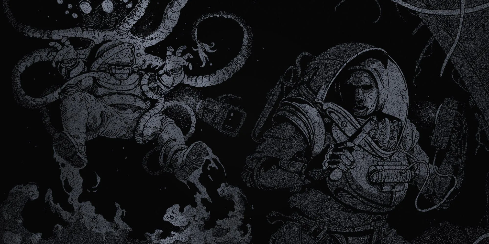
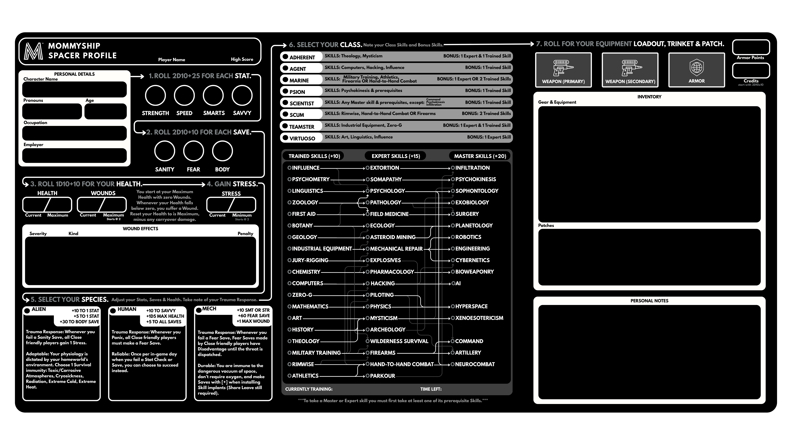
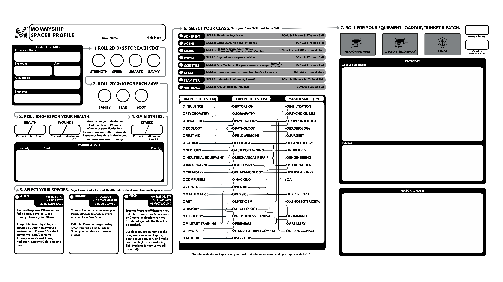

# 1.0 MAKING YOUR CHARACTER

{.splash-banner}

Welcome to Mommyship, the sci-fi horror RPG where you and your crew try to survive in the most inhospitable environment in the universe: outer space! Excavate dangerous derelict spacecraft, explore strange unknown worlds, encounter hostile alien life, and escape the horrors encroaching upon your every move. Let's get started!

The provided character sheet has all the instructions for how to create your character. All you need to do is follow the numbered steps in each box until you've filled everything in.

{.character-sheet}

<a href="../../assets/images/MommyshipSpacerSheet-DARK.png" download="MommyshipSpacerSheet-DARK.png" class="sheet-download">Download Dark Sheet</a>

{.character-sheet}

<a href="../../assets/images/MommyshipSpacerSheet-LIGHT.png" download="MommyshipSpacerSheet-LIGHT.png" class="sheet-download">Download Light Sheet</a>

## 1.1 ROLL STATS

Characters have four Stats: **Strength, Speed, Smarts,** and **Savvy,** representing how well they act under pressure.

Roll 2 ten-sided dice (2d10), add them together, then add 25. Repeat this three more times to come up with 4 stat numbers, which you may then assign freely to **Strength, Speed, Smarts,** and **Savvy.**

A stat of 36 is average, but don't get too hung up on the numbers right now.

## 1.2 ROLL SAVES

Characters have three Saves: **Sanity, Fear,** and **Body,** representing how resistant and reactive they are to different kinds of trauma and danger.

Roll 2 ten-sided dice (2d10), add them together, then add 10. Repeat this two more times to come up with 3 stat numbers, which you may then assign freely to **Sanity, Fear,** and **Body.**

## 1.3 ROLL HEALTH

Characters can suffer a maximum number of **Wounds** before they die. Characters gain a Wound when their **Health** reaches zero.

Roll 1d10, then add 10. Record the result as your **Maximum Health.**

## 1.4 GAIN STRESS

Characters' current **Stress** and **Minimum Stress** both start at 2.

## 1.5 SELECT YOUR SPECIES

Characters each have a specific **Species*,*** which further modify their Stats, Saves, Health, and Wounds. Each Species also deals with Stress and **Panic** differently, which comes into play later in the game, and has another unique trait. Mark your unique **Trauma Response** for future reference.

There are three Species options, as detailed here:

**Alien**
:   Intelligent life comes in all shapes, sizes, forms, and phenotypes.

    - +10 to 1 Stat
    - +5 to 1 Stat
    - +30 Body Save
    - **Trauma Response:** Whenever you fail a Sanity Save, all Close friendly players gain 1 Stress.
    - **Adaptable:** Your physiology is dictated by your homeworld's environment. Choose 1 Survival immunity: Toxic/Corrosive Atmospheres, Cryosickness, Radiation, Extreme Cold, Extreme Heat.

**Human**
:   Basic, sturdy, plentiful, and stubborn.

    - +10 Savvy
    - +5 to all Saves
    - +1d5 Max Health
    - **Trauma Response:** Whenever you Panic, all Close friendly players must make a Fear Save.
    - **Reliable:** Once per in-game day when you fail a Stat Check or Save, you can choose to succeed instead.

**Mech**
:   Superior by design (and also subservient).

    - +10 Smarts or Strength
    - +60 Fear Save
    - +1 Max Wound
    - **Trauma Response:** Whenever you fail a Fear Save, Fear Saves made by Close friendly players have Disadvantage until the threat is dispatched.
    - **Durable:** You are immune to the dangerous vacuum of space, don't require oxygen, and make Saves with [+] when installing Skill implants (Shore Leave still required).

## 1.6 SELECT YOUR CLASS

Classes broadly define your characters' backgrounds and assign **Skills** your character has experience with.

Mark your class, and select your Skills accordingly. Each class comes preloaded with relevant Skills, which help
characters perform better at different challenges. Additionally, each class has a number of bonus Skills to select.

To choose a Skill, you must have at least one prerequisite Skill (a Skill that has an arrow pointing from it) first.

There are eight class options, as detailed here:

1. **Adherent**: Theology, Mysticism.
     - **Bonus:** 1 Expert Skill with prerequisite & 1 Trained Skill.

2. **Agent**: Computers, Hacking, Influence.
     - **Bonus:** 1 Trained Skill.

3. **Marine**: Military Training, Athletics, Firearms OR Hand-to-Hand Combat
     - **Bonus:** 1 Expert Skill with prerequisite or 2 Trained Skills.

4. **Psion**: Psychokinesis with prereqs.
     - **Bonus:** 1 Trained Skill.

5. **Scientist**: Any Master Skill with prereqs, except: Command, Psychokinesis, Infiltration.
     - **Bonus:** 1 Trained Skill.

6. **Scum**: Rimwise, Hand-to-Hand Combat OR Firearms.
     - **Bonus:** 2 Trained Skills.

7. **Teamster**: Industrial Equipment, Zero-G.
     - **Bonus:** 1 Expert Skill with prerequisite & 1 Trained Skill.

8. **Virtuoso**: Art, Influence, Linguistics.
     - **Bonus:** 1 Expert Skill with prerequisite.

## 1.7 ROLL FOR GEAR

Roll for a **Loadout** based on your character's class.

| D10 | ADHERENT | AGENT | MARINE | PSION |
| :---: | ----- | ----- | ----- | ----- |
| 0 | Preacher's Attire (1 AP, as Reinforced Clothing), Foam Gun (2 canisters), Medscanner, Mohab Unit | Armor Vest (4 AP), Sniper Rifle (3 rounds), Paracord, Chemlight (×5) | Tank Top & Camo Pants (1 AP, as Reinforced Clothes), Combat Knife, Stimpack ×5 | Laboratory Jumpsuit (1 AP, as Reinforced Clothing), Psypulse Launcher, Rebreather  |
| 1 | Preacher's Attire (1 AP, as Reinforced Clothing), Flare Gun (3 flares), Water Filtration Device, Pet (Synthetic) | Civilian Clothes (1 AP, as Reinforced Clothes), Fountain Pen (As Poison Injector), Briefcase, Pamphlets | Fatigues (2 AP, as Commissioned Attire), Large Stick (As Martial Bludgeon), Dog (pet), Leash, Tennis Ball | Laboratory Jumpsuit (1 AP, as Reinforced Clothing), Hardlight Holoblade, Chemlight, Medscanner |
| 2 | Commissioned Attire (2 AP), Scythe (As Basic Blade), Salvage Drone, Pet (Organic) | Corporate Attire (2 AP, as Commissioned Attire), Stun Baton, VIP Corporate Keycard, Soci-stim (×3) | Assault Infantry Armor (7 AP), Combat Shotgun (4 rounds), MoHab Unit, Rucksack | Containment Suit (2 AP, as Hazard Suit), Energy Whip, Powercell (×3), First Aid Kit |
| 3 | Commissioned Attire (2 AP), Varmint Rifle (4 rounds), Patch Kit (×3), Ambidextrin (×3) | Cybersuit (8 AP), Cane with Hidden Sword (As Martial Blade), VIP Corporate Keycard | Assault Infantry Armor (7 AP), Pulse Rifle (3 mags), Infrared Goggles | Containment Suit (2 AP, as Hazard Suit), Mind Melter, Geiger Counter, Emergency Beacon |
| 4 | Civilian Vaccsuit (3 AP), Walking Stick (As Basic Bludgeon), Radiation Pills (×5) | Civilian Clothes (1 AP, as Reinforced Clothes), Holdout Pistol (6 rounds), Long-Range Comms, Lockpick Set | Assault Infantry Armor (7 AP), Smart Rifle (3 mags), Binoculars, Personal Locator | Containment Suit (2 AP, as Hazard Suit), Chem-caster, Focusitol (×3) |
| 5 | Civilian Vaccsuit (3 AP), Stun Baton, Rebreather, Immunisol (×2) | Armor Vest (4 AP), Foam Gun (1 canister), Patch Kit (×3), Focusitol | Assault Infantry Armor (7 AP), SMG (3 mags), MRE (×7), Water Filtration Device | Cryo-pod PJ's (3 AP, as Civilian Vaccsuit), Improvised Scrap Sword (As Large Blade), Binoculars, Lubrenisone (×2) |
| 6 | Hazard Suit (2 AP), Flare Gun (2 flares), Short-Range Comms, Quickoag | Battle Vaccsuit (6 AP), Hacking Dart, Personal Locator, Automed (×5) | Assault Infantry Armor (7 AP), Flamethrower (4 shots), Boarding Axe, Emergency Beacon | Cryo-pod PJ's (3 AP, as Civilian Vaccsuit), Rebar (As Large Bludgeon), Personal Locator, MoHab Unit |
| 7 | Hazard Suit (2 AP), Foam Gun (3 canisters), Stimpack | Cybersuit (8 AP), Smart Rifle (1 mag), Radio Jammer, Lubrenisone (×2) | Fatigues (2 AP, as Commissioned Attire), Revolver (12 rounds), Frag Grenade | Cryo-pod PJ's (3 AP, as Civilian Vaccsuit), Psypulse Launcher, Automed (×5) |
| 8 | Missionary Vestments (5 AP, As Longhaul Jumpsuit), Pump Shotgun (4 rounds), Water Filtration Device, Zenzetrine | Standard Crew Attire (1 AP, as Reinforced Clothes), Wrist Knife (As Basic Blade), Jump-9 Ticket (destination blank) | Dress Uniform (1 AP, as Reinforced Clothes), Holdout Pistol, Extraordinary Service Medal | Super-soldier Suit (7 AP, as Standard Infantry Armor), Energy Whip, Hardineram (×2) |
| 9 | Missionary Vestments (5 AP, As Longhaul Jumpsuit), MoHab Unit, Automed (×5) | Corporate Spywear (10 AP, as Black Ops Armor), Mindmelter, Mag-boots | Powered Infantry Armor (12 AP), General-Purpose Machine Gun (1 Can of ammo), Smart Link Add-On | Cybersuit (8 AP), Poison Injector, Long-Range Comms, Soci-stim (×3) |
| — | **SCIENTIST** | **SCUM** | **TEAMSTER** | **VIRTUOSO** |
| 0 | Lab Coat (1 AP, as Reinforced Clothes), Tranq Pistol (3 shots), Bioscanner, Sample Collection Kit | Ratty Clothing (0 AP, as Standard Clothing), Throwing Blades, Lockpick Set, MRE ×7 | Ship's Uniform (3 AP, as Civilian Vaccsuit), Rivet Gun, Crowbar, Flashlight | Haute Couture (2 AP, as Commissioned Attire), Stun Baton, Holotunes |
| 1 | Civilian Clothes (1 AP, as Reinforced Clothes), Fountain Pen (As Poison Injector), Prescription Pad, Briefcase | Repurposed Jumpsuit (1 AP, as Reinforced Clothing), Nail Gun (3 mags), Electronic Tool Set, Mylar Blanket | Ship's Uniform (3 AP, as Civilian Vaccsuit), Laser Cutter (1 extra battery), Patch Kit (×3), Toolbelt with Assorted Tools | Holofit (1 AP, as Reinforced Clothing), Spray & Lighter, Art Supplies (as Assorted Tools), Quickoag (×2) |
| 2 | Labsuit (3 AP, as Civilian Vaccsuit), Rigging Gun, Flashlight, Sample Collection Kit, Lab Rat (pet) | Repurposed Jumpsuit (1 AP, as Reinforced Clothing), Revolver, Explosives & Detonator, Metallysis (×3) | Standard Crew Attire (1 AP, as Reinforced Clothes), Flare Gun (2 rounds), Water Filtration Device, Personal Locator | Haute Couture (2 AP, as Commissioned Attire), Tranq Pistol, Sewing Kit, Metallysis (×3) |
| 3 | Labsuit (3 AP, as Civilian Vaccsuit), Foam Gun (2 charges), Foldable Stretcher, First Aid Kit,  | Battle Vaccsuit (6 AP),Crowbar, Short-Range Comms, Soci-stim (×3) | Ship's Uniform (3 AP, as Civilian Vaccsuit), Rigging Gun (1 shot), Shovel, Salvage Drone | Holofit (1 AP, as Reinforced Clothing), Smoke Grenade, Rebreather, Focusitol (×3) |
| 4 | Lab Coat (1 AP, as Reinforced Clothes), Screwdriver (as Assorted Tools), Medscanner, Vaccine (1 dose) | Faction Bomber Jacket (2 AP, as Commissioned Attire), Vibechete, Jetpack, Metallysis (×3) | Heavy Duty Work Clothes (2 AP, as Commissioned Attire), Explosives & Detonator, Cigarettes | Haute Couture (2 AP, as Commissioned Attire), Holdout Pistol, Electronic Tool Set, Soci-stim (×3) |
| 5 | Lab Coat (1 AP, as Reinforced Clothes), Portable Computer Terminal, Cybernetic Diagnostic Scanner | Faction Bomber Jacket (2 AP, as Commissioned Attire), Grenade Launcher, Frag Grenade ×2, Smoke Grenade ×2 | Heavy Duty Work Clothes (2 AP, as Commissioned Attire), Hand Welder, Paracord (100m), Salvage Drone | Holofit (1 AP, as Reinforced Clothing), Holdout Pistol, Portable Computer Terminal, MRE ×7 |
| 6 | Standard Crew Attire (1 AP, as Reinforced Clothes), Scalpel, Cybernetic Diagnostic Scanner, Duct Tape | Salvage Suit (7 AP, as Standard Infantry Armor), Vibrosword, Radio Jammer, Quickoag (×2) | Standard Crew Attire (1 AP, as Reinforced Clothes), Combat Shotgun (4 rounds), Cat (pet) | Armor Vest (4 AP), Hardlight Holoblade, First Aid Kit |
| 7 | Hazard Suit (2 AP), Flamethrower (1 charge), Electronic Tool Set, Stimpack | Civilian Vaccsuit (3 AP), Varmint Rifle, Salvage Drone, Hardineram (×2) | Standard Crew Attire (1 AP, as Reinforced Clothes), Nail Gun (32 rounds), Assorted Tools | Armor Vest (4 AP), Smart Rifle, Portable Computer Terminal, Lubrenisone (×2) |
| 8 | Scrubs (1 AP, as Reinforced Clothes), Scalpel, Oxygen Tank with Filter Mask, Automed (×5) | Armor Vest (4 AP), Power Saw, Powercell (×3), Quickoag | Hazard Suit (2 AP), Vibechete, Spanner, MoHab Unit, Water Filtration Device | Civilian Vaccsuit (3 AP), Holdout Pistol, Jetpack, Automed (×5) |
| 9 | Scrubs (1 AP, as Reinforced Clothes), Raygun, Mylar Blanket, First Aid Kit | Cybersuit (8 AP), Scrap Knife (as Scalpel), Automed (×5) | Lounge Wear (1 AP, as Reinforced Clothes), Crowbar, Beer, Stimpack | Cybersuit (8 AP), Prism Whip, Powercell (×3), Pet (Synthetic) |

Roll for a **Trinket** (1d100).

| 00 | Manual: *PANIC: Harbinger of Catastrophe* | 34 | Pendant: Shell Fragments Suspended in Plastic | 67 | Coffee Cup, Chipped, reads: HAPPINESS IS MANDATORY |
| :---: | :---- | ----- | :---- | :---: | :---- |
| 01 | Antique Company Scrip (Asteroid Mine) | 35 | Pamphlet: *Zen and the Art of Cargo ArRangement* |  |  |
| 02 | Manual: *SURVIVAL: Eat Soup with a Knife.* | 36 | Pair of Shot Glasses (spent shotgun shells) | 68 | Manual: *Moonshining with Gun Oil Fuel* |
| 03 | Desiccated Husk Doll | 37 | Key (Childhood Home) | 69 | Miniature Chess Set, Bone, Missing Pieces |
| 04 | Pressed Alien Flower (common) | 38 | Dog Tags (Heirloom) | 70 | Gyroscope, Bent, Tin |
| 05 | Necklace of Shell Casings | 39 | Token: "Is Your Morale Improving?" | 71 | Faded Green Poker Chip |
| 06 | Corroded Android Logic Core | 40 | Pamphlet: *The Relic of Flesh* | 72 | Ukulele |
| 07 | Pamphlet: *Signs of Parasitical Infection* | 41 | Pamphlet: *The Indifferent Stars* | 73 | Spray Paint |
| 08 | Manual: *Treat Your Rifle Like a Lady* | 42 | Calendar: Military Battles | 74 | Wanted Poster, Weathered |
| 09 | Bone Knife | 43 | Manual: *Rich Captain, Poor Captain* | 75 | Locket, Hair Braid |
| 10 | Calendar: Alien Pin-Up Art | 44 | Campaign Poster (Home Planet) | 76 | Sculpture of a Rat, Gold |
| 11 | Rejected Application (Colony Ship) | 45 | Preserved Insectile Aberration | 77 | Blanket, Fire Retardant |
| 12 | Holographic Serpentine Dancer | 46 | Titanium Toothpick | 78 | Hooded Parka, Fleece-Lined |
| 13 | Snake Whiskery | 47 | Gloves, Leather (Xenomorph Hide) | 79 | BB Gun |
| 14 | Medical Container, Purple Powder | 48 | Smut (Seditious): *The Captain, Ordered* | 80 | Flint Hatchet |
| 15 | Pills: Male Enhancement, Shoddy | 49 | Towel, Slightly Frayed | 81 | Pendant: Two Astronauts form a Skull |
| 16 | Casino Playing Cards | 50 | Brass Knuckles | 82 | Rubik's Cube |
| 17 | Lagomorph Foot | 51 | Fuzzy Handcuffs | 83 | Stress Ball, reads: *Zero Stress in Zero G* |
| 18 | Moonstone Ring | 52 | Journal of Grudges | 84 | *Sputnik* Pin |
| 19 | Manual: *Mining Safety & You* | 53 | Stylized Cigarette Case | 85 | Ushanka Hat |
| 20 | Pamphlet: *Against Human Simulacra* | 54 | Ball of Assorted Gauge Wire | 86 | Trucker Cap, Mesh, Grey Alien Logo |
| 21 | Animal Skull, 3 Eyes, Curled Horns | 55 | Spanner | 87 | Menthol Balm  |
| 22 | Bartender's Certification (Expired) | 56 | Switchblade, Ornamental | 88 | Pith Helmet |
| 23 | Banraku Puppet | 57 | Powdered Xenomorph Horn | 89 | 10m x 10m Tarp |
| 24 | Prospecting Mug, Dented  | 58 | Bonsai Tree, Potted | 90 | *I Ching,* Missing Sticks |
| 25 | Eerie Mask | 59 | Golf Club (Putter) | 91 | Kukri |
| 26 | Ultrablack Marble | 60 | Trilobite Fossil | 92 | Trench Shovel |
| 27 | Ivory Dice | 61 | Pamphlet: A Lover In Every Port | 93 | Shiv, Sharpened Butter Knife |
| 28 | Tarot Cards, Worn, Pyrite Gilded Edges | 62 | Patched Overalls, Personalized | 94 | Taxidermied Cat |
| 29 | Bag of Assorted Teeth | 63 | Fleshy Thing Sealed in a Murky Jar | 95 | Pamphlet: Interpreting Sheep Dreams |
| 30 | Ashes (A Relative) | 64 | Spiked Bracelet | 96 | Faded Photograph, A Windswept Heath |
| 31 | DNR Beacon Necklace | 65 | Harmonica | 97 | Opera Glasses |
| 32 | Cigarettes (Grinning Skull) | 66  | Pictorial Pornography, Dog-eared, Well-thumbed, Optionally stained | 98 | Pamphlet: *Android Overwatch* |
| 33 | Pills: Areca Nut |  |  | 99 | Interstellar Compass, Always Points to Homeworld  |

Roll for a **Starting Patch.**

| D100 | STARTING PATCHES | ADVANCED PATCHES |
| :---: | ----- | ----- |
| 00 | "When In Doubt, Lick It" [+1 Archeology] | Armadillo with a hardhat & big cigar [+1 Armor Points] |
| 01 | Icarus [+1 Art] | "Hold Fast" Across Knuckles [+1 Armor Points] |
| 02 | "ROCKHOPPER" [+1 Asteroid Mining] | "I Am Not a Robot" [+1 Artificial Intelligence] |
| 03 | Running Man holo-gif [+1 Athletics] | (cartoon bombs that look like boobs) [+1 Artillery] |
| 04 | Ibuprofen Bottle [+1 Body Save] | Spirochete Bacterium Cell [+1 Bioweaponry] |
| 05 | "Botanists Like it Dirty" [+1 Botany] | "Take Me To Your Leader" (UFO) [+1 Command] |
| 06 | (atomic structure of methamphetamine) [+1 Chemistry] | "Aspiring Cyberpsycho" [+1 Cybernetics] |
| 07 | "Troubleshooter" [+1 Computers] | Red Gear [+1 Engineering] |
| 08 | Biohazard Symbol [+1 Ecology] | Minion Bitmoji [+1 Exobiology] |
| 09 | "One Size Fits All" (grenade) [+1 Explosives] | "For Science!" [+1 Hyperspace] |
| 10 | "Material Grrl" [+1 Extortion] | "Intern" [+1 Infilitration] |
| 11 | "SUCK IT UP" [+1 Fear Save] | "I Don't Take Steroids" [+1 Max HP] |
| 12 | Medic Patch (skull & crossbones over cross) [+1 Field Medicine] | Liver King [+1 Max HP] |
| 13 | Dove in Crosshairs [+1 Firearms] | "Sponsored by: Cardiox" [+1 Max Wounds] |
| 14 | "Triage Trainee" [+1 First Aid] | "Universal Donor" [+1 Max Wounds] |
| 15 | "Kick Rocks!" [+1 Geology] | Single bloodshot eye [+1 Neurocombat] |
| 16 | "Firewall Fighter" [+1 Hacking] | "NOMAD" [+1 Planetology] |
| 17 | Boxing Gloves [+1 Hand-to-Hand Combat] | "STRANGE AEONS" [+1 Psychokinesis] |
| 18 | Nerd Emoji "🤓" [+1 History] | Retro Robot Head [+1 Robotics] |
| 19 | Jackhammer Pin-up, Masc [+1 Industrial Equipment] | "Intellect Be Damned" [+1 Sophontology] |
| 20 | "Upstanding Citizen" [+1 Influence] | "The Louder You Scream the Faster I Come" (Nurse Pin-Up) [+1 Surgery] |
| 21 | "Do I LOOK Like an Expert?" [+1 Smarts] | Holographic Horror [+1 Xenoesotericism] |
| 22 | "Can't Fix Stupid" [+1 Jury-Rigging] | "Thick-Skinned" [+2 Armor Points] |
| 23 | "Отвали" ("Fuck off" in Russian) [+1 Linguistics] | Madonna Conical Bra [+2 Armor Points] |
| 24 | "U+ME=?" [+1 Mathematics] | "All Natural, Free-Range AI" [+2 Artificial Intelligence] |
| 25 | Risk of Electrocution Symbol [+1 Mechanical Repair] | (cartoon gun that looks like a dick) [+2 Artillery] |
| 26 | "Honorably Discharged" [+1 Military Training] | Houseplant with a handgun [+2 Bioweaponry] |
| 27 | Tarot Card (of your choice) [+1 Mysticism] | "DO YOUR JOB" [+2 Command] |
| 28 | "Do a Backflip" [+1 Parkour] | "Enhanced" [+2 Cybernetics] |
| 29 | Mr. Yuck [+1 Pathology] | "Keep Well Lubricated" [+2 Engineering] |
| 30 | "Allergic to Bullshit" (Medical Style Patch) [+1 Pharmacology] | "Travel To Distant Places/Meet Unusual Things/Get Eaten" [+2 Exobiology] |
| 31 | "der/dow/die" partial derivative symbol [+1 Physics] | (wormhole graphic) [+2 Hyperspace] |
| 32 | Crossed Hammers with Wings [+1 Piloting] | "HELLO MY NAME IS: _____" [+2 Infilitration] |
| 33 | Crystal Ball [+1 Psychometry] | Space Water Bottle "Well Hydrated :)" [+2 Max HP] |
| 34 | "Take My Life (Please)" [+1 Psychology] | "I Took My Nutripaste" [+2 Max HP] |
| 35 | Jolly Roger [+1 Rimwise] | "BOHICA" (Bend Over Here It Comes Again) [+2 Neurocombat] |
| 36 | "I ♥ Myself" [+1 Sanity Save] | Ride My Rings (gas giant) [+2 Planetology] |
| 37 | Smile with a Golden Tooth [+1 Savvy] | Skull w/3 eye sockets [+2 Psychokinesis] |
| 38 | "Bad Vibes" [+1 Somapathy] | "I'm a (Love) Machine" [+2 Robotics] |
| 39 | "Volunteer" [+1 Speed] | "Existential Crisis Alert" [+2 Sophontology] |
| 40 | "Don't Run You'll Only Die Tired" Backpatch [+1 Strength] | "Scalpel Jockey" [+2 Surgery] |
| 41 | Mother Mary Multiverse (Cathology) [+1 Theology] | Chibi Cthulhu [+2 Xenoesotericism] |
| 42 | "Not Without My Knife" [+1 Wilderness Survival] | Chibi Slagworm [+3 Armor Points] |
| 43 | Pin-Up Model (Hair Floating) [+1 Zero-G] | Knight in Full Plate with Arrow through Visor [+3 Armor Points] |
| 44 | Scorpion-Sugarglider [+1 Zoology] | Chalkbones Pride [+3 Max HP] |
| 45 | NASA Logo [+2 Archeology] | Grim Reaper Backpatch [+3 Max HP] |
| 46 | Smiley Face (glow in the dark) [+2 Art] | "It's for Ritual Use" [+5 Archeology] |
| 47 | (ass)-teroids [+2 Asteroid Mining] | "A Picture's Worth a Thousand Bytes" [+5 Art] |
| 48 | (dumbells with asteroids as weights) [+2 Athletics] | "I Think, Therefore I RAM" [+5 Artificial Intelligence] |
| 49 | "Meatbag" [+2 Body Save] | (both previous patches titfucking) [+5 Artillery] |
| 50 | "Biosphere Dweller" [+2 Botany] | "I'd Rather Be Drilling" [+5 Asteroid Mining] |
| 51 | Periodic Table [+2 Chemistry] | "Fully Licensed" (flexing arms) [+5 Athletics] |
| 52 | Windows 2195 Logo [+2 Computers] | Hazard Symbol "Nasty Farts" [+5 Bioweaponry] |
| 53 | "Megafauna" [+2 Ecology] | "Photosynthetical!" [+5 Botany] |
| 54 | "Front Towards Enemy" (Claymore Mine) [+2 Explosives] | (beaker with skull in serum) [+5 Chemistry] |
| 55 | "Fuck Around, Find Out" [+2 Extortion] | "Because I Said So" [+5 Command] |
| 56 | Fun Meter (reads: Bad Time) [+2 Fear Save] | (green-line code screen, matrix-style) [+5 Computers] |
| 57 | Blood Type (Reference Patch) [+2 Field Medicine] | "N3TRUNN3R" [+5 Cybernetics] |
| 58 | "Be Sure: Doubletap" [+2 Firearms] | Recycling Symbol, pulsing [+5 Ecology] |
| 59 | "WOOFER" [+2 First Aid] | (universal engine symbol) [+5 Engineering] |
| 60 | (cracked geode) [+2 Geology] | Alien Autopsy [+5 Exobiology] |
| 61 | "Smile: Big Brother is Watching" [+2 Hacking] | "Boom! There it is" [+5 Explosives] |
| 62 | "DRINK/FIGHT/FUCK" [+2 Hand-to-Hand Combat] | "Dead Men Tell Great Tales" [+5 Extortion] |
| 63 | "Debate Me" [+2 History] | "Stimpack" [+5 Field Medicine] |
| 64 | Jackhammer Pin-up, Femme [+2 Industrial Equipment] | (flexing arm, on fire) [+5 Firearms] |
| 65 | "Plays Well With Others" [+2 Influence] | "Fix Me First" Cadeceus [+5 First Aid] |
| 66 | "Good" (Brain) [+2 Smarts] | "2.5 Mohs" [+5 Geology] |
| 67 | (2 rubber bands, a stick of gum, and a paperclip) [+2 Jury-Rigging] | "I'm in." [+5 Hacking] |
| 68 | "Ask Me About Tongues" [+2 Linguistics] | (brass knuckles) [+5 Hand-to-hand Combat] |
| 69 | (incorrect equation) [+2 Mathematics] | Ancient Greco-Roman Pottery Pornography [+5 History] |
| 70 | Pin-Up Model (Mechanic) [+2 Mechanical Repair] | "Beam Me Up!" [+5 Hyperspace] |
| 71 | "Dishonorably Discharged" [+2 Military Training] | "I Like My Tools Clean/And My Lovers Dirty" [+5 Industrial Equipment] |
| 72 | "Do You Believe in Dog?" [+2 Mysticism] | "If You Can Read This, I've Already Killed You" [+5 Infiltration] |
| 73 | "Clean Exit" [+2 Parkour] | "Resistance is Futile" [+5 Influence] |
| 74 | Blood Spatter [+2 Pathology] | MacQuasar [+5 Jury-Rigging] |
| 75 | (thunderstorm raining pill capsules) [+2 Pharmacology] | Rosetta Plinth [+5 Linguistics] |
| 76 | "Actually, I AM a Rocket Scientist" [+2 Physics] | "Algebraic!" [+5 Mathematics] |
| 77 | "Smooth Operator" [+2 Piloting] | "Percussive Maintenance" [+5 Mechanical Repair] |
| 78 | "Is this your card?" [+2 Psychometry] | Crimson Heart [+5 Military Training] |
| 79 | "Eject Me Already" [+2 Psychology] | Deteriorated Megamind PNG [+5 Mysticism] |
| 80 | Laser Lasso [+2 Rimwise] | "Ultra Plus" [+5 Neurocombat] |
| 81 | "IMPROVISE/ADAPT/OVERCOME" [+2 Sanity Save] | "PARKOUR!" [+5 Parkour] |
| 82 | "Bad Bitch" [+2 Savvy] | Syringe labeled "git gud" [+5 Pathology] |
| 83 | "Universal Recipient" [+2 Somapathy] | "Don't talk to me until I've had my Wellbutrin" [+5 Pharmacology] |
| 84 | Winged Boots [+2 Speed] | "Delta" change symbol [+5 Physics] |
| 85 | "Powered by Coffee" [+2 Strength] | "Do a Barrel Roll" [+5 Piloting] |
| 86 | "The Great Machine" (AIslam) [+2 Theology] | "Bring Back Pluto" [+5 Planetology] |
| 87 | "Watch Your Step" [+2 Wilderness Survival] | Cerebral Chameleon [+5 Psychokinesis] |
| 88 | Magboots [+2 Zero-G] | "Beyond All Bounds" [+5 Psychometry] |
| 89 | "APEX PREDATOR" (Sabertooth Skull) [+2 Zoology] | "Freudian Twist" (skeleton rolling in coffin) [+5 Psychology] |
| 90 | (titanium heart) [+3 Body Save] | Laser Lasso [+5 Rimwise] |
| 91 | (ghost sticking its tongue out) [+3 Fear Save] | Bunnybot Logo [+5 Robotics] |
| 92 | "Are You Smarter than a 5th Grader?" [+3 Smarts] | "LIMINAL MINDS" [+5 Somapathy] |
| 93 | (screws in a skull) [+3 Sanity Save] | "Mind Palace" [+5 Sophontology] |
| 94 | "DILLIGAF" [+3 Savvy] | "Ripper? I Hardly Know 'er!" [+5 Surgery] |
| 95 | "IF I'M RUNNING, KEEP UP" Backpatch [+3 Speed] | Whistlepig! [+5 Wilderness Survival] |
| 96 | Can of Space Spinach [+3 Strength] | Too Many Tentacles [+5 Xenoesotericism] |
| 97 | Tylenol Bottle [+4 Body Save] | "Warning: Low Gravity Zone" sign [+5 Zero-G] |
| 98 | (entirety of [Litany Against Fear](https://dune.fandom.com/wiki/Litany_Against_Fear)) [+4 Fear Save] | Roseate Spoonbill Stork [+5 Zoology] |
| 99 |  Light Spectrum Graph [+3 Any Skill] | Prism [+5 Any Skill] |

Determine how many **Credits** you have. Credits (cr) are the primary currency in Mommyship, and are notated as follows:

- 100cr = 100 credits
- 2.5kcr = 2.5 thousand credits (2,500cr)
- 35.2mcr = 35.2 million credits (35,200,000cr)
- 4bcr = 4 billion credits (4,000,000,000cr)

Characters get 2d10×10cr in addition to their Starting Loadout. If you want to forgo a Starting Loadout and buy gear piecemeal, roll 2d10×100cr for starting credits instead.

## 1.8 FINISHING TOUCHES

Write the character's name and pronouns. Mark a zero above High Score. You're now ready to play your first session of Mommyship! Good luck!
