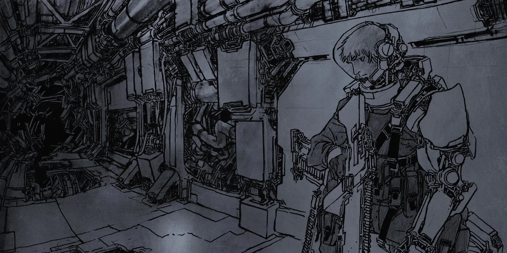

# 3.0 OPERATING COSTS

{.splash-banner}

Everything about spacecraft, from purchasing one to paying for its repairs, maintenance, and upgrades, is out of reach to the average person. Only the most powerful planets, corporations, and the uber-wealthy can commission a brand new ship to be built. Even for those who can afford to own one, it often ends up consuming their entire lives. 

Most people who wind up on ships don't know them — they're contracted to a Company or Military who foots the bill for repairs, supplies, and salaries. For the few lucky (or unlucky) enough to find themselves an Owner-Operator or Freelancer, you'll be taking on the majority of costs yourself as a part of doing business. 

| WHO PAYS THE BILLS? |  |  |  |
| ----- | :---: | :---: | :---: |
|  | **COMPANY** | **MILITARY** | **OWNER-OPERATOR** |
| **SALARY** | ✔ | ✔ | ✔ |
| **HAZARD PAY** | Approved only. | ✔ | Approved only. |
| **JUMP PAY** | Approved only. | ✔ | Approved only. |
| **ROOM & BOARD** | On ship only. | On ship and base. | On ship only. |
| **REFUELING** | ✔ | ✔ | ✔ |
| **WARP CORES** | Approved only. | ✔ | Approved only. |
| **REPAIRS** | Approved only. | ✔ | ✖ |
| **UPGRADES** | Approved only. | Approved only. | ✖ |
| **SKILL TRAINING** | ✖ | Approved only. | ✖ |
| **MEDICAL TREATMENT** | ✖ | On ship and base. | ✖ |
| **EQUIPMENT** | Approved only. | Approved only. | ✖ |
| **WEAPONS** | ✖ | ✔ | ✖ |

## 3.1 THE COMPANY

When you work for a Company, they own the ship and cover any associated costs. You just cash a paycheck and do the work they ask. And don't get any fancy ideas about a new Upgrade, the bean counters at HQ aren't going to approve frivolous expense requests. 

## 3.2 THE MILITARY

On a military ship, everything is covered, provided it's part of the mission. You don't even have to worry about whether you'll be able to afford your medical bills. They'll even cover Skill training if it's relevant to your occupational specialty, just so long as you follow orders. 

## 3.3 OWNER-OPERATORS

Sometimes, ships are owned by small banking firms who co-finance the purchase of a ship and then either lease it or enter into a co-ownership agreement with another small company. The firm fronts the cost of the vessel and business operations, and in turn takes the majority share of the profits. In exchange, you get a ship and a relatively free hand in conducting your business on the Rim as Owner-Operator of a small vessel.

As an Owner-Operator, you have a new save, called a **Bankruptcy Save,** which starts at 2d10 + 10. Each year (or quarter, as determined by your Warden), make a Bankruptcy Save to determine the financial health of the vessel.

- **Success:** You scrape by. Choose one of the following:  
    - Purchase 1 Minor Upgrade or Amenity for the ship.  
    - Perform 1 Major Repair on the ship.  
    - Pay each Crewmember a bonus of 2d5 months salary.  
    - Raise your Bankruptcy Save by 1d5.  
- **Critical Success:** You turn a small profit. Choose one of the following:  
    - Purchase 1 Major Upgrade or Defense for the ship.  
    - Perform 1d5 Major Repairs on the ship.  
    - Pay each Crewmember a bonus of 1d5 × 100kcr.  
    - Raise your Bankruptcy Save by 2d5.  
- **Failure:** You owe 1d5 Debt to your financiers.  
- **Critical Failure:** The vessel goes into bankruptcy, loses financing, becomes a Freelancer, and owes 2d5 Debt to the worst people imaginable.

## 3.4 FREELANCERS

Freelancers are people who have bought outright (or otherwise acquired) a vessel, and pay for everything themselves. It's incredibly expensive and they have to beg, barter, borrow, or steal credits wherever they can find them. But on the upside, you have what few in the galaxy do: *freedom.*

## 3.5 DEBT

Most Owner-Operators and Freelancers will inevitably wind up with Debt, which represents the amount they owe a specific organization for the purchase, upkeep, or operation of their vessel. Much like Stress, Debt can be accrued and potentially leveraged into advancements for your crew and ship, but having too much of it opens you up to negative consequences and potential downward spirals. It's easy to fall into Debt, but hard to dig yourself out. Perhaps counterintuitively, you cannot repay Debt with cred — it represents the leverage another entity has over yourself or your crew rather than an actual monetary amount.

- **5 Debt** buys a cramped, cobbled-together deathtrap that is only good for limping from system to system.  
- **10 Debt** buys a small, no-frills jump courier with all the essentials, but limited space for crew and cargo.  
- **15 Debt** secures a battered commercial vessel able to earn a living (e.g., a freight, salvage cutter, or asteroid breaker).

For crews without ships, Debt could instead represent a sum they owe a loan shark, for buying out a Company contract, or legal fees, etc.

### *3.5.1 WHAT'S IN IT FOR ME?*

It's not all bad! When a crew has Debt, their creditors pay for the following costs:

- Fuel and Warp Cores  
- Basic repairs and maintenance  
- Contractor salaries (but not signing bonuses)

Additionally, more Debt can be taken on by the crew for various benefits:

- **Ship Upgrades:** +1 Debt for each 5mcr of new Upgrades, Weapons, or Amenities.  
- **Cyberware:** +1 Debt for each crew to gain a Trained Skill implant.  
- **Hard Currency:** +1 Debt to immediately gain 1d5 Salary for all crew & contractors.  
- **Shore Leave:** +1 Debt to take Shore Leave in a B-Class Port.

### *3.5.2 DEBT CHECKS*

A Debt Check determines whether a crew can handle the pressure of interest piling up on their obligations. To make a Debt Check, roll the Panic Die (1d20) and attempt to roll greater than your current Debt. If you fail, look up the relevant result on the Debt Table. A crew cannot have more than 20 Debt.

A crew makes a Debt Check when:

- They finish Shore Leave.  
- They gain Debt for any reason.  
- They go a significant period of time without bringing in any real work.  
- They upset their creditors somehow.

### *3.5.3 DEBT TABLE (D20)*

| D20 | EFFECT |
| :---: | ----- |
| 01 | **DIVIDEND.** A spending rewards program accrues, giving each crew member a Jump-1 ticket. |
| 02 | **OPPORTUNITY.** The crew's creditors demand they do a sensitive and/or dangerous job for them at enhanced pay ([+] Payroll). |
| 03 | **ANXIETY.** Each crew member gains 1 Stress. |
| 04 | **CREDIT LIMIT.** The crew cannot take on additional Debt or go on Shore Leave until the next time Debt is reduced. |
| 05 | **WEAR AND TEAR.** The crew's piece of armor with the highest AP breaks and is reduced to 0 AP. |
| 06 | **NEPOTISM.** The crew's creditors force a contractor of dubious merit on them. |
| 07 | **LOCKDOWN.** The crew's creditors refuse to pay for Warp Cores until the next time their Debt is reduced. Each crewmember's Minimum Stress is increased by 1. |
| 08 | **BEHEST.** The crew's creditors demand they do a job for them at normal pay. |
| 09 | **OUT OF WARRANTY.** Each crew member determines the piece of equipment they use most often. It breaks and must be replaced. |
| 10 | **PAYROLL ISSUE.** Contractor paychecks bounce. Pay each contractor one month's salary out of pocket, or make a Loyalty save to prevent them from quitting. |
| 11 | **ASSURANCE.** The crew's creditors must approve all of their major movements and jobs until the next time Debt is reduced. |
| 12 | **FROZEN**. The crew's bank accounts are frozen. They cannot spend credits until the next time Debt is reduced. |
| 13 | **BEST BEFORE.** All of the crew's consumable items (chems, food, ammo) expire and must be replaced. |
| 14 | **CHAPERONE.** A representative of the crew's creditors joins them on their next job. It would be extremely bad for the crew if the rep is harmed. |
| 15 | **HEADHUNTER.** A faction attempts to poach the crew's contractors with an offer their creditors won't match. Make a Loyalty save to prevent them from quitting. |
| 16 | **FINAL NOTICE.** The crew loses 50% of its credits to a critically overdue bill, but gets -1 Debt. |
| 17 | **LOCKOUT.** The crew is barred from a particular port until their Debt is cleared. Each crew member increases their Minimum Stress by 1. |
| 18 | **EXTORTION.** The crew's creditors demand they do a job for them, with no pay. |
| 19 | **ACQUISITION.** A new organization purchases the crew's debt and demands immediate payment. The crew loses 80% of its credits, but gets -1 Debt. |
| 20 | **LIQUIDATION**. A squad of repo-men arrives to reclaim the crew's belongings, by deadly force if necessary. |

### *3.5.4 DIGGING YOUR WAY OUT*

Debt tracks “big” income and costs. Most jobs that a crew in debt take on pay in the form of reducing their Debt:

- -1 Debt: Any standard job. A particularly good load of salvage, or precious materials.  
- -2 or 3 Debt: A longer or complex job, or one that would warrant Hazard Pay. A singularly valuable piece of salvage or a covert task performed.  
- -4 or more Debt: Meticulous heists, or genuine acts of heroism that save infrastructure or creditor assets. Artifacts that could change the balance of power in a sector.

A crew in Debt still tracks “small” income and expenditures, and a few credits usually trickle over into their accounts after their creditors take their share of any reward. When a crew gets paid for a job or sells a haul, they reduce their Debt and then make a Payday roll: the crew splits 1d10 × 10kcr between themselves.

Crews having trouble scraping together pocket money can take jobs “off the books” by Moonlighting; these jobs pay standard salary, but cannot reduce Debt. This is universally frowned upon by creditors.

