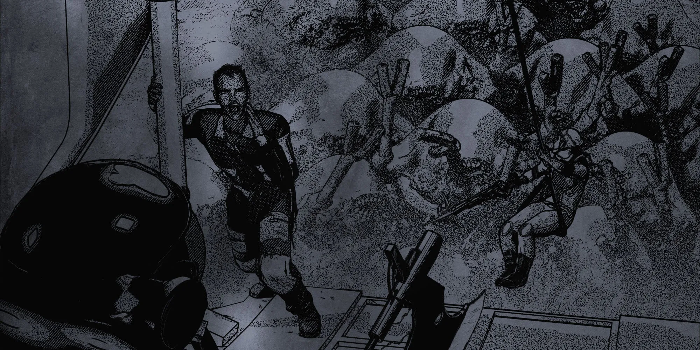

# 2.0 SPACE TRAVEL {#2.0-space-travel}

{.splash-banner}

The galaxy is vast and unforgiving, and you represent the rarest of the rare: someone for whom space travel is not only necessary, but common. You should know the basics.

## 2.1 ORBITAL TRAVEL

Most large spaceships are not equipped for atmospheric entry and thus rely on shuttles, dropships, and other C-0 reentry vehicles to land or take off from the surface of a planet. Some C-I and C-II vessels may have had landing gear specially retrofitted to allow for ground-to-orbit launching/landing. 

## 2.2 INTERPLANETARY TRAVEL

Interplanetary trips can take anywhere from a few weeks to reach a nearby planet, to several years to reach the edge of the system. These trips are made via the ship's thrusters at a cost of 1 unit of Fuel for every month of travel. Fuel costs are paid up-front once the destination for the trip has been decided and it costs 1 Fuel to change course.

## 2.3 REFUEL & RESUPPLY

You refuel and resupply your ship while in port. Each Ship Class uses a different grade of Fuel, but Fuel from a ship one class below yours can be siphoned and used on a 2:1 basis. Likewise, Fuel from a ship one class above yours can be used on a 1:2 basis. All other Fuel is incompatible.

After any number of engagements equal to your ship's class where you used your ship's weapons, you must resupply. If you fail to resupply, Battle Checks are at [-] on your next ship combat. After that, you automatically fail all Battle Checks.

| REFUEL & RESUPPLY | COST |
| :---: | :---: |
| **Class-I Fuel** | 10kcr |
| **Class-II Fuel** | 20kcr |
| **Class-III Fuel** | 50kcr |
| **Class-IV Fuel** | 100kcr |
| **Class-V Fuel** | 200kcr |
| **Ship Ammunition** | 50kcr/Weapon |

## 2.4 INTERSTELLAR TRAVEL

To travel to other star systems, you need a vessel equipped with a **Jump Drive.** Jump Drives are powerful engines designed to allow a ship to move faster than the speed of light and travel great distances by “jumping” into hyperspace. 

### *2.4.1 JUMP DRIVES*

Jump Drives are rated from 1–9 based on how large a jump they can make. The vast majority of commercial vessels built for interstellar travel use a Jump-1 Drive. Only powerful corporations, governments, and militaries use Jump-4 or greater. **Each Jump to hyperspace expends 1 unit of a powerful Fuel known as a Warp Core.**

### *2.4.2 JUMP POINTS*

Before a ship can enter hyperspace, it must first travel to a Jump Point a safe distance away from neighboring planets or space stations. Many of these points are maintained at common ‘warp lanes' by large corporations, allowing for an interstellar highway system. **It usually takes a few weeks to reach the Jump Point** from which the ship can then safely enter hyperspace.

### *2.4.3 CRYOSLEEP*

Most crews spend their time in hyperspace in cryosleep while an android monitors an astronavigation computer. Those who stay awake during hyperspace jumps report strange and conflicting stories about the experience, and often androids' memories of their time in hyperspace are at best described as… unsettling.

### *2.4.4 TIME DILATION*

Jumps through hyperspace take 2d10 days. However, the effects of relativity on Faster-Than-Light travel are uncertain and seemingly random. A crew returns from a Jump-3 voyage to learn they have been gone several years, while others return only a few seconds after their departure. 

Regular Jump-1 warp lanes seem to wear down the chaotic effects, but those who make long jumps, like the legendary JUMP-9 COLONY SHIPS, are never expected to return. No one is certain what the effects of multiple Jump-9s would be. And perhaps those pioneers have returned, just millenia into our future. Or else somewhere in our past.

## 2.5 BOOKING PASSAGE

You don't need to own a ship to get across the galaxy, but you need to pay your way, either in credits, trade, or labor. 

| TRAVEL COSTS | — | — | — |
| :---: | :---: | :---: | :---: |
| **ORBITAL SHUTTLE** | **COST** | **HAULING & TOWING** | **COST** |
| Passenger Seating | 250cr | Interplanetary, C-I | 100kcr |
| Cargo Space | 1kcr | Interplanetary, C-II | 200kcr |
| Private Shuttle | 5kcr | Interstellar, C-I | 250kcr |
| Coffin Lander  (orbit-to-ground only) | 50cr | Interstellar, C-I | 500kcr |
| **PASSENGER LINER (INTERPLANETARY)** | **COST** | **PASSENGER LINER (INTERSTELLAR)** | **COST** |
| Steerage Deck (cryopod only) | 1kcr | Steerage Deck (cryopod only) | 2kcr |
| Second Class (4 bunks/cabin, cryopod) | 2.5kcr | Second Class (4 bunks/cabin, cryopod) | 5kcr |
| First Class (private cabin, cryopod) | 10kcr | First Class (private cabin, cryopod) | 20kcr |
| Cargo Space | 5kcr | Cargo Space | 20kcr |
| Hangar Space | 25kcr | Hangar Space | 500kcr |
| To a distant planet  | ×2 | Jump-2 Ticket | +10kcr |
| To edge of the system | ×3 | Jump-3 Ticket | +30kcr |
| **EXECUTIVE TRANSPORT (INTERPLANETARY )** | **COST** | **EXECUTIVE TRANSPORT (INTERSTELLAR )** | **COST** |
| Director Class (private suite, cryopod) | 20kcr | Director Class (private suite, cryopod) | 40kcr |
| Assistant Class (private cabin, cryopod) | 12kcr | Assistant Class (private cabin, cryopod) | 25kcr |
| Chartered Vessel | 1mcr | Chartered Vessel | 2mcr |

## 2.6 SHIP-TO-SHIP CONTACT

### *2.6.1 RANGE* {#2.6.1-range}

During encounters with other ships, your distance is measured abstractly in three **Range Bands.** These are: 

- **Detection Range**: Ships are within the same star system. Communication is slow. They are typically not a combat risk. They can detect each other's size and trajectory.  
- **Firing Range:** Ships are within weeks of each other. They can communicate with some latency and are at risk for combat.  
- **Contact Range**: Ships are within a few days of each other. They can communicate without latency and are at risk for combat and boarding.

Your ship's scanners can be used to learn information about enemy craft, derelicts, space stations, as well as planets, moons, asteroids, and other celestial objects. The closer your Range, the more detailed information the ship's sensors and scanners can learn. The amount of detail they provide is left up to the Warden's discretion. 

Communication across the vast reaches of space is difficult and time consuming. The greater the Range between the communicating parties, the more time it takes between sending and receiving messages.

| RANGE | INFORMATION REVEALED | HAILING LATENCY |
| :---: | ----- | ----- |
| Detection | Presence, trajectory, rough size, any transponder info broadcasting. | Minutes to hours. |
| Firing | All above, and ship class & type. | Seconds. |
| Contact | All above, and presence of lifeforms, ship's status. | None. |

Your **Transponder** constantly broadcasts important information about your ship, including among other things its **Callsign**, the name of its Captain, as well as the type of ship, its Class, home port, destination, and more. Transponder information is subject to the Latency as shown on the Hailing table above.

### *2.6.2 DISTRESS SIGNALS* {#2.6.2-distress-signals}

Occasionally, you may need to put your ship on emergency power, seal yourself in cryopods, send out a Distress Signal, and wait for help. It's a long shot, but sometimes it's the only shot you've got. When this happens, roll on the **Distress Signals Table** below.

The result of this roll is how long it takes for help to pick up your Distress Signal and arrive to provide aid and/or finish you off.

| ⠀D10⠀ | CORE WORLDS | ASTEROID BELT | RIM SPACE | DEEP SPACE/DEAD ZONES |
| :---: | :---: | :---: | :---: | :---: |
| 00 | **1d10 DAYS** Fate is on your side. | **2d10 DAYS** Fate is on your side. | **2d10 WEEKS** You're one of the lucky ones. | **2d10 MONTHS**  Remember to review the Company policy on backpay in the event of a cryo-emergency. |
| 01–02 | **2d10 DAYS** Fate is on your side. | **2d10 WEEKS** You're one of the lucky ones. | **2d10 MONTHS** Remember to review the Company policy on backpay in the event of a cryo-emergency. | **2d10 YEARS** Make a Body Save or lose 1d5 to all Stats & Saves. |
| 03–04 | **1d10 WEEKS** You're one of the very lucky ones. | **2d10 MONTHS**  Remember to review the Company policy on backpay in the event of a cryo-emergency. | **2d10 YEARS** Make a Body Save or lose 1d5 to all Stats & Saves. | **2d10 DECADES** Make a Body Save [-] or lose 1d10 to all Stats & Saves. |
| 05–06 | **1d10 MONTHS** Remember to review the Company policy on backpay in the event of a cryo-emergency. | **2d10 YEARS** Make a Body Save or lose 1d5 to all Stats & Saves. | **2d10 DECADES** Make a Body Save [-] or lose 1d10 to all Stats & Saves. | **NEVER** The ship floats endlessly in the all-consuming void of space. Thanks for playing Mommyship. |
| 07–08 | **2d10 MONTHS** Remember to review the Company policy on backpay in the event of a cryo-emergency. | **1d10 DECADES** Make a Body Save [-] or lose 1d10 to all Stats & Saves. | **NEVER** The ship floats endlessly in the all-consuming void of space. Thanks for playing Mommyship. | **NEVER** The ship floats endlessly in the all-consuming void of space. Thanks for playing Mommyship. |
| 09 | **1d10 YEARS** Make a Body Save [+] or lose 1d5 to all Stats & Saves. | **NEVER** The ship floats endlessly in the all-consuming void of space. Thanks for playing Mommyship. | **NEVER** The ship floats endlessly in the all-consuming void of space. Thanks for playing Mommyship. | **???** You wake up. Something is horribly, *horribly* wrong. |

## 2.7 SHIP-TO-SHIP COMBAT {#2.7-ship-to-ship-combat}

Combat between two spaceships may look slow and serene, but for the crews it's like a natural disaster. Each ship moves at impossible speeds, firing computer-aimed weaponry hours or even days away from their targets. The slightest bit of damage can disable or destroy an entire ship, its crew dying from flames, radiation, suffocation, or worse.

### *2.7.1 SHIP ROUNDS*

During a violent confrontation, we split time into intervals called ship rounds. Each ship round is made up of three phases: Movement, Attack, and Morale.

How long is a ship round? Anywhere from a few minutes to a few hours depending on how far apart the ships are. After each ship round, time returns to normal while you and the other players plan your next move in anticipation of the next ship round. Ships at contact Range only have a few minutes between ship rounds (enough for a few rounds of normal time). Ships at firing Range may have anywhere from a few hours to several days between rounds.

Most ship combats are over in 1 round. Almost none go longer than 3.

### *2.7.2 WHAT CAN I DO?*

Ship-to-ship combat assumes each ship and its crew are doing everything they can to win the confrontation. It assumes that each ship and its crew are taking evasive maneuvers, firing at their best targets, and generally making sound tactical decisions. 

Your job is to discuss with the rest of the crew and decide when to fight, when to flee, and when to negotiate or surrender.

### *2.7.3 THE MOVEMENT PHASE*

During the **Movement Phase**, ships decide whether they are going to attempt to evade or pursue other ships, or maintain their current course. They then decide how much extra Fuel (if any) they're willing to burn. 

**If you're attempting to Evade…**  
While you may spend as much Fuel as you like, to make an attempt you must spend a minimum amount of Fuel based on your Range from the enemy ship: 

| RANGE | FUEL COST |
| :---: | :---: |
| Detection | 1 Fuel |
| Firing | 2 Fuel |
| Contact | 3 Fuel |

**If you're attempting to Pursue…**  
You may spend any amount of Fuel you want (even none). 

Once you have determined the total amount of Fuel you want to bid, each side reveals their choice and makes a Thrusters Check. Whoever bid more Fuel gets [+] on the Check.

- **Success:** You get what you want and increase or decrease the distance between you and the enemy ship by one band.  
- **Critical Success:** You make progress even if the enemy also succeeded.   
- **Failure:** You don't get what you want, and the distance between you and the enemy ship does not change.  
- **Critical Failure:** Your enemy makes progress even if they failed.

**If you're maintaining course…**  
You don't spend any extra Fuel, but your enemy gets what they want (to evade or pursue) without having to roll (though they spend any extra Fuel they bid).

### *2.7.4 THE ATTACK PHASE* {#2.7.4-the-attack-phase}

At the end of the **Movement Phase**, all ships within firing Range or closer choose a target and make a Battle Check.

- **Success:** Ship deals MDMG.  
- **Critical Success:** Ship deals double MDMG.  
- **Failure:** Ship takes 1 MDMG in addition to any dealt by the enemy.  
- **Critical Failure:** Ship takes 2 MDMG in addition to any dealt by the enemy.

If a ship has no weapons, or their weapons are offline, they automatically fail all Battle Checks.

**Megadamage (MDMG)** is like a character's Damage and Wounds rolled into one. Whenever your ship takes MDMG, add it to any previous MDMG incurred, mark the new total on the tracker, and apply the listed effect. If your ship ever has 9 or more total MDMG, it is destroyed.

| MDMG | EFFECT |
| :---: | :---: |
| 00 | **ALL SYSTEMS NOMINAL.** 5x5, ready to ride. |
| 01 | **EMERGENCY FUEL LEAK.** Every time you spend Fuel, you spend 1 more. |
| 02 | **FIRE ON DECK.** Fire spreads around the ship, creating a Toxic/Corrosive atmosphere.  Deals 1d10 DMG/round to crew in affected areas. |
| 03 | **HULL BREACH.** All aboard make a Body Save or take 1 Wound (Explosion).  On a Critical Failure, get violently sucked into Space. |
| 04 | **RADIATION LEAK.** Radiation Level increases every hour. |
| 05 | **WEAPONS OFFLINE.** Automatically fail Battle Checks. 10% chance a Hardpoint is destroyed. |
| 06 | **NAVIGATION OFFLINE.** Automatically fail Thrusters Checks. 10% all navigation data wiped. |
| 07 | **LIFE SUPPORT OFFLINE.** Oxygen limited to 1d10 × maximum crew capacity. |
| 08 | **DEAD IN THE WATER.** All systems offline, emergency power only. |
| 09 | **ABANDON SHIP!** Ship is destroyed in 1d10 minutes. |

**Hull** works like a character's Armor Points. Your ship ignores all MDMG less than its current Hull. If it takes MDMG equal to or greater than its Hull in one hit, reduce the MDMG inflicted by the amount of the Hull, apply any remaining, and then reduce the current Hull by 1.

#### *2.7.4.1 Ship Class and Unwinnable Fights*

You have [+] on all Battle Checks and MDMG rolls against ships 1 Class lower than yours. Ships 2 or more classes higher than enemy ships are assumed to be unbeatable in a direct confrontation unless the Warden decides otherwise.

### *2.7.5 THE MORALE PHASE*

After any Ship Round where an enemy takes MDMG, they must make a Morale Check. To make a Morale Check, roll 1d10. If they roll under their current MDMG, they may send a hail offering a ceasefire to make negotiations.

### *2.7.6 AFTER BATTLE REPORT*

After any violent confrontation where your ship takes MDMG, make a Systems Check. On a failure, roll on the Maintenance Issues table**.** On a Critical Failure, roll on the table twice.

## 2.8 REPAIRING YOUR SHIP

Eventually, your ship will need a tune-up, or sometimes a complete overhaul. When this happens, you'll need to get it repaired.

### *2.8.1 STARTING CONDITION*

Every ship starts with a little wear-and-tear. Whenever you acquire a ship, roll 1d5 + 1 Repairs from the Maintenance Issues table.

### *2.8.2 ROUTINE MAINTENANCE*  {#2.8.2-routine-maintenance}

Once a month (or more), your ship needs to perform a **Maintenance Check**. To do this, make a Systems Check. If your vessel contains parts of a lower level of degradation than Pristine, you must make these Checks a number of times equal to the lowest level of part degradation currently installed.

- **Success:** Everything continues working as normal.  
- **Critical Success:** [+] the next time you roll on the Maintenance Issues table.  
- **Failure:** Roll on the Maintenance Issues table, and everyone onboard gains 1 Stress.  
- **Critical Failure:** Roll on the Maintenance Issues table twice, and everyone onboard makes a Panic Check.

### *2.8.3 MINOR REPAIRS*

**Minor Repairs** cover cosmetic damage, clean-up, and other handyman-type work that can be handled by the crew while the ship is in flight. Minor Repairs take roughly 2d10 days to perform and require no roll.

If you have Refurbished or Used Upgrades/Hardpoints installed on your ship and an Engineer onboard, you can take an additional 2d10 days per Upgrade/Hardpoint to improve their degradation level by 1 (Used → Refurbished → Pristine). Risky Upgrades or Hardpoints cannot benefit from Minor Repairs.

### *2.8.4 MAJOR REPAIRS*

**Major Repairs** cover large scale structural or system damage, including repairing MDMG and Hull. **Major Repairs can only be performed in port and cost 1mcr multiplied by the Ship's Class** (unless you have a Machine Shop on board). Every point of Hull or Megadamage counts as a separate Major Repair for cost purposes.

Major Repairs can take anywhere from a few months to up to a year depending on the severity of the damage, and availability of parts and labor. They will not change the condition of Upgrades or Hardpoints.

### *2.8.5 MAINTENANCE ISSUES TABLE* {#2.8.5-maintenance-issues-table}

***Note:** If a repair has an associated 10% rate for something to go wrong, roll 1d10. On a 0, the effect triggers. For 50% odds, even-digit rolls are good and odd-digit rolls are bad.*

| ISSUES |  |  |                                                                           |  |  |
| :---: | :---: | :---: | :---: | :---: | :---: |
| **MINOR REPAIRS** |  |  |                                                                           |  |  |
| 00 | Rancid smell permeates cabins. | 34 |                           Worn landing struts.                            | 67 | Miscalibrated guidance system. |
| 01 | Huge mess everywhere. | 35 |                         Out-of-date air filters.                          |  |  |
| 02 | Staticky comms. | 36 |                              Corroded pipes.                              | 68 | Overloaded power storage. |
| 03 | Faulty electrical system. | 37 |                 Inaccurate orbital transfer information.                  | 69 | Sensor arrays only display porn. |
| 04 | Loose couplings. | 38 |                      Worn out Fuel injector nozzles.                      | 70 | Failed water recovery systems. |
| 05 | Hidden (highly illegal) contraband. | 39 |                      Inoperative exterior lighting.                       | 71 | Micro-meteroid hull damage. |
| 06 | Autopilot systems down. | 40 |                           Defective intercomms.                           | 72 | Carbon dioxide alarm won't stop. |
| 07 | Leaking hydraulics. | 41 |                        Inadequate waste recycling.                        | 73 | Solar panel degradation. |
| 08 | Creaking hull. | 42 |                    Faulty altitude control thrusters.                     | 74 | Computer failure from cosmic radiation. |
| 09 | Damaged bulkheads. | 43 |                   Insufficient Life Support redundancy.                   | 75 | Overloaded circuitry. |
| 10 | Misaligned docking clamps. | 44 |                       Delayed communications relay.                       | 76 | Malfunctioning plasma thruster. |
| 11 | Viewports blocked. | 45 |                            Damaged Fuel lines.                            | 77 | Dehumidifier failure. |
| 12 | Jammed exterior airlocks. | 46 |                        Corroded exhaust manifolds.                        | 78 | Intermittent electrical outages. |
| 13 | Dysfunctional gravity plating. | 47 |                       Terminal displays burnt-out.                        | 79 | Fire suppression out of code. |
| 14 | Out of code compliance. | 48 |                            Check engine light.                            | 80 | Damaged floor panelling. |
| 15 | Controls sticking. | 49 |                        Failed data backup systems.                        | 81 | Broken light fixture in remote corridor. |
| 16 | Coolant leak. | 50 |                            Faulty door locks.                             | 82 | Damaged coolant pump. |
| 17 | Miscalibrated thruster gimbal system. | 51 |                           Buggy communications.                           | 83 | Cracked viewports. |
| 18 | Bevy of OSHA violations. | 52 |                     Infested food storage facilities.                     | 84 | Systems full of malware. |
| 19 | Blocked air vents. | 53 |                           Corrupted data banks.                           | 85 | Leaky Fuel valve. |
| 20 | Emergency lighting only. | 54 |                          Jammed cargo bay doors.                          | 86 | Jammed exhaust vent. |
| 21 | Internal networking issues. | 55 |                        Flickering interior lights.                        | 87 | Clogged waste disposal chute. |
| 22 | Inaccurate data collection. | 56 |                           Failed airlock seals.                           | 88 | Lifts non-functional. |
| **MAJOR REPAIRS** |  |  |                                                                           |  |  |
| 23 | **Oxygen Leak.** If the ship is low on O2, lose 1d5 extra per day. | 57 |          **Fuel Leak.** Burn +1 Fuel every time you spend Fuel.           | 89 | **Clogged Air Filtration.** Max crew capacity is halved. (Mechs don't count). |
| 24 | **Throttled Afterburners.** -2d10 Thrusters. | 58 |      **Jump Bug.** 10% chance Jump takes 2d10 months, not 2d10 days.      | 90 | **Broken Backup Generator.** No emergency power. |
| 25 | **Lemon.** Maintenance Checks at [-]. | 59 |                     **Fragile.** Always take +1 MDMG.                     | 91 | **Weakened Frame.** -1 Maximum Hull. |
| 26 | **Slow Acceleration.** +1 Week to travel. | 60 |       **Cracked Heat Shields**. Ship becomes Extremely Hot or Cold.       | 92 | **Chemical Spill.** Body Saves [-] While on board.  |
| 27 | **Inaccurate Navigation.** 50% chance pathfinding is faulty. | 61 |                   **Outdated Software.** -1d10 Systems.                   | 93 | **Scanner Reduction.** Ship has to be one Range closer to broadcast/receive. |
| 28 | **Miscalibrated Targeting Sensors.** -1d10 Battle. | 62 |    **Contaminated Water Purification.** Parasites in the water supply.    | 94 | **Transponder Slagged.** Cannot turn Transponder On.  |
| 29 | **Faulty Cryopods**. Nightmares, cryosickness lasts +1 Week. | 63 | **Malfunctioning Waste Management.**  One Amenity becomes non-functional. | 95 | **Corrupted A.I.** [-] on Systems Checks. |
| 30 | **Malfunctioning Escape Pods.** 50% chance will not eject from ship. | 64 |             **Fusion Reactor Overheating.** -1d10 Thrusters.              | 96 | **Drive Jamming.** 10% chance warp core consumed and Jump fails. |
| 31 | **Cycling Transponder**. Unable to send Distress Signals. | 65 |            **Failed Radiation Shielding.** +1 Radiation Level.            | 97 | **Rust Bucket.** +1 Minimum Stress to all crew. |
| 32 | **Sabotaged Coolant System.** [-] Rest Checks while onboard. | 66  |        **Structural Damage.** One Upgrade becomes non-functional.         | 98 | **Security Malfunction.** 1d5 bulkheads seal and will not open.  |
| 33 | **Death Trap.** [-] on all Ship Checks. |  |                                                                           | 99 | **Slagged.** One Hardpoint becomes inoperable. |

